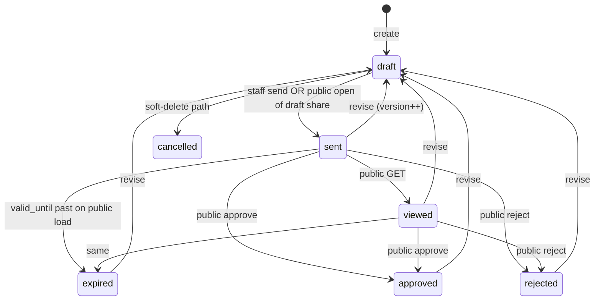

# Quote Builder — Complete Product & Capability Audit

**Date:** 2026-09-22  
**Scope:** Forensic / product research only — **zero code changes**  
**Primary surface:** `/app/quotes/new` and shared `QuoteBuilder`  
**Method:** Trace UI → state → hooks → API client → FastAPI → rules → DB/RPC → returned values  

This document is the **authoritative factual map** of what Quote Builder supports **today**, based on the current codebase — not migration docs, not intended UX, not industry CPQ norms.

---

## 1. Executive factual summary

SITE SECURE Quote Builder is a **server-authoritative CPQ workspace** for security-system quotes:

| Domain | Fact |
|---|---|
| Entry | `/app/quotes/new` opens a **local-only** draft (`id: ""`). Server row appears only after content/action → `createOnce()` → `POST …/quotes`. |
| Totals | Browser **cannot** set `total_gross` / `subtotal_net` / `vat_amount` / `cost_total`. FastAPI `pricing.recalculate` + `_persist_totals` own money. |
| System design | **CCTV-only** production path: `SystemBuilderDrawer` → `POST …/cctv/recommend` → apply catalog lines. Other system types are UI stubs. |
| Approval | Label **שליחה לאישור** = staff **send** (lock draft → `sent` + public token). **Customer** approves/rejects on `/public/quotes/$token`. No staff approve API. |
| Save label **טרם נשמרה** | Literally: quote has **no server id** yet (`QuoteSaveIndicator` when `!hasLiveId`). |
| Commercial security | `quotes.view_cost` strips cost/margin from API responses; technicians have **no** quote grants (+ hard commercial deny set). |
| Site | Optional for draft/send; **required** to create project after approval. Does **not** feed pricing or CCTV math. |
| PDF | Staff PDF after send uses **live lines** + **frozen company/template**; public PDF uses **version snapshot**. |

---

## 2. Quote creation journey (real, from code)

There is **no forced wizard**. `QuoteStepper` only scrolls zones (`details | items | pricing | review`).

```
Entry (/app/quotes/new | NewQuoteDialog | deep-link ?customerId&siteId&leadId)
  → Local unsavedQuote (id="")
  → Customer (search/create) + optional site/lead + header fields
  → First persist (autosave w/ content | Save | add line/section/template/system)
       → createOnce → api.createQuote → navigate replace → /$quoteId
  → Build lines (catalog / free / packages / templates / CCTV System Builder)
  → Pricing (server recalculate on every mutating API)
  → Summary (desktop sidebar | mobile sheet from total chip)
  → Preview (in-builder live pane OR /preview after save)
  → Send (SendQuoteConfirm → api.sendQuote) when readiness critical gaps clear
  → Customer portal approve/reject (/public/quotes/$token or /q/$token)
  → Optional: revise → new draft version; project-from-quote (needs site)
```

| Stage | User can | Required to progress | Blocks | Mutation |
|---|---|---|---|---|
| Local new | Edit UI freely | — | Empty local draft skips create | None until content |
| Customer | Search/select/create/change | **Required to send** | `customer` critical gap | `createCustomer` / patch quote |
| Site | Select/create (if customer) | Optional for send; **required for project** | Soft readiness warning | `createSite` / patch `site_id` |
| Items | Add/edit/delete/reorder | ≥1 billable line to send | `items`/price critical gaps | `addQuoteItem` / patch / delete |
| System Builder | CCTV design → recommend → apply | Optional | Catalog unresolved (partial apply allowed) | section + `addQuoteItem` loop |
| Discounts | Quote amount/%; line % | Optional | — | patch quote / item |
| VAT | Display only in builder | Workspace default on create | — | Not in `headerPatch` |
| Preview | Staff document / live pane | Content or id | Preview disabled if empty local | May `createOnce` first |
| Send | Confirm + channel UX | `quotes.send` + draft + no critical gaps | `QUOTE_INCOMPLETE` | `POST …/send` |
| Approve | Customer signs/approves | Public token + version | Superseded token | `approvePublicQuote` |

---

## 3. Route map

| ROUTE | PURPOSE | COMPONENT | WHO | CRUD |
|---|---|---|---|---|
| `/app/quotes/` | List / search / duplicate / delete | `QuotesWorkspace` via `RequirePermission("quotes.view")` | Members with `quotes.view` | R list; D delete; C duplicate |
| `/app/quotes/new` | Unsaved builder | `QuoteBuilder` + `unsavedQuote()` | `quotes.create` | No create on mount |
| `/app/quotes/$quoteId` | Persisted builder (edit if draft) | `QuoteBuilder` | `quotes.view` (+ edit/send/…) | R get; U mutations |
| `/app/quotes/$quoteId/preview` | Staff preview / send / PDF / share | `QuoteDocument`, share/send dialogs | `quotes.view` (+ send) | R document; U send/share; PDF |
| `/public/quotes/$token` | Customer review / sign / approve / reject / PDF | `CustomerQuoteExperience` | Token (no session `can`) | R public; U approve/reject |
| `/q/$token` | Short redirect | → `/public/quotes/$token` | — | — |
| `/app/settings/quotes` | Workspace quote prefs | Settings | `workspace.edit` | Not builder |
| `/app/settings/pdf-templates` | PDF template studio | Settings | PDF template perms | Not quote viewer |
| `/app/settings/company` | Company + **payment details** | `PaymentDetailsCard` | Company edit | Feeds PDF/docs |

**Not found:** dedicated `/edit`, `/approval`, or `/pdf` quote pages. Detail = edit surface when draft + `quotes.edit`.

### `/app/quotes/new` open sequence

1. `RequirePermission("quotes.create")`  
2. `unsavedQuote(workspaceId, { customerId?, siteId?, leadId? })` → `id: ""`, `status: "draft"`  
3. `QuoteBuilder` with `saveState: "local"`  
4. Optional search-param seed + `resolveQuoteContext` auto-site  
5. **No** `api.createQuote` until autosave/content/action (`createOnce`)

Evidence: `apps/web/src/routes/app/quotes/new.tsx`, `apps/web/src/lib/quote-builder.ts` (`unsavedQuote`, `draftHasContent`), `QuoteBuilder.tsx` (`createOnce`, autosave ~900ms).

---

## 4. Component architecture

```
QuoteBuilder                          CRITICAL (~2.5k lines — mutations live here)
├── QuoteHeader + QuoteSaveIndicator + QuoteStepper
├── QuoteLifecycleBanner
├── QuoteContextBar → QuoteContextCard / CustomerSelector / site Select / create site
├── details fields (title, validity, project, terms, discounts, template)
├── TemplateFastPath
├── QuoteLinesPanel → QuoteLineRow / QuoteSectionNameField
├── QuoteSidebar | QuoteMobileSheet → QuoteSidebarPanel
│     ├── QuoteSummaryAside
│     ├── UnifiedReadiness
│     ├── RevisionComparePanel
│     └── QuoteAuditStrip
├── QuoteMobileActionsBar + QuoteMobileAddMenu
├── live preview → QuoteDocument
├── QuoteQuickAdd
├── SendQuoteConfirm / QuoteShareDialog / ProjectFromQuoteDialog
├── SystemPickerModal / TemplateApplyModal
└── SystemBuilderDrawer                 CRITICAL (CCTV)
```

| Component | File | Responsibility | Business logic? | Risk |
|---|---|---|---|---|
| QuoteBuilder | `components/quotes/QuoteBuilder.tsx` | Persist gate, all mutations, send/share/PDF, layout | **Yes** | **CRITICAL** |
| QuoteHeader | `workspace/QuoteHeader.tsx` | Identity, save, CTAs, stepper | No | LOW |
| QuoteStepper | `workspace/QuoteStepper.tsx` | Scroll navigation chrome | No | LOW |
| QuoteSaveIndicator | `workspace/QuoteSaveIndicator.tsx` | local/saving/saved/error | No | LOW |
| QuoteContextBar / Card | `workspace/` + `quote-creation/` | Customer/site summary | No | LOW |
| CustomerSelector | `quote-creation/CustomerSelector.tsx` | Search pick | Light fetch | MEDIUM |
| QuoteLinesPanel | `cpq/QuoteLinesPanel.tsx` | Scope UI / catalog search / sections | Mostly UI; parent mutates | **HIGH** |
| QuoteLineRow | `cpq/QuoteLineRow.tsx` | Line editors + local draft | Local preview net | **HIGH** |
| QuoteSummaryAside | `cpq/QuoteSummaryAside.tsx` | Totals / margin display | Display of server fields | MEDIUM |
| UnifiedReadiness | `workspace/UnifiedReadiness.tsx` | Send checklist | Presentation of gaps | MEDIUM |
| SystemBuilderDrawer | `cpq/SystemBuilderDrawer.tsx` | CCTV recommend → apply | **Yes** | **CRITICAL** |
| SystemPickerModal | `cpq/SystemPickerModal.tsx` | Package pick | No | MEDIUM |
| QuoteMobileSheet / ActionsBar | `workspace/QuoteMobile*.tsx` | Mobile summary + dock | No | MEDIUM |
| QuoteDocument | `document/QuoteDocument.tsx` | Customer-facing render | No | MEDIUM |
| SendQuoteConfirm | `SendQuoteConfirm.tsx` | Confirm send | No | MEDIUM |
| NewQuoteDialog | `quote-creation/NewQuoteDialog.tsx` | Pre-route customer/site → `/new` | Workflow UI | MEDIUM |
| QuoteCustomerView | `QuoteCustomerView.tsx` | Deprecated wrapper → QuoteDocument | Legacy | LOW |

Supporting libs: `quote-builder.ts`, `quote-cpq.ts`, `quote-readiness.ts`, `quote-lifecycle.ts`, `quote-live-document.ts`, `quote-line-edit.ts`, `cctv-*`, `system-builder.ts` (legacy matcher).

---

## 5. Data model (important fields)

Grouped; evidence: `packages/api-client` `QuoteOut`/`QuoteItemOut`, `supabase/migrations/0016_quotes.sql`, `0034_cpq_phase2.sql`, `apps/api/app/routers/quotes.py`.

### IDENTITY
| Field | Type | Source | Client editable? | Server gen? | Required | Stored | Displayed |
|---|---|---|---|---|---|---|---|
| `id` | uuid | DB | No | Yes on create | After persist | `quotes` | Header |
| `number` | text | Server | No | Yes | — | `quotes` | Header |
| `version` | int | Server | No | Yes; ++ on revise | — | `quotes` | Header / public |
| `workspace_id` | uuid | Session | No | On create | Yes | `quotes` | — |
| `status` | enum | Server transitions | No (via send/etc.) | Yes | — | `quotes` | Header / lifecycle |
| `title` | text | Client | Yes (draft) | No | **Send critical** | `quotes` | Details / doc |

### CUSTOMER / SITE
| Field | Editable? | Required | Notes |
|---|---|---|---|
| `customer_id` | Yes | **Send critical** | Clearable via API; no “remove” UI once set (change only) |
| `site_id` | Yes | Optional send; **required for project-from-quote** | Filtered by customer |
| `lead_id` | Yes | Optional | Prefill / deep-link |

### COMMERCIAL / TERMS
| Field | Editable? | Notes |
|---|---|---|
| `payment_terms` | Yes | **Send critical** |
| `warranty`, `general_terms`, `customer_notes`, `internal_notes` | Yes | Header draft |
| `summary`, `key_points` | Yes | Header |
| `project_name`, `project_address` | Yes | May copy from site |
| `currency` | Server/default | Displayed |
| `valid_until` | Yes | **Send critical** |
| `discount_type` / `discount_value` | Yes | Quote-level amount **or** percent |
| `vat_percent` | API + workspace default; **not** in builder `headerPatch` | Stored on quote |

### LINE ITEMS
| Field | Notes |
|---|---|
| `item_type` | DB: `catalog \| free \| labor \| note` |
| `qty`, `unit_price`, `discount`, `discount_type` | Client inputs |
| `cost` | Server/catalog; stripped without `view_cost` |
| `line_net` | **Server calculated + stored** |
| `product_id`, `catalog_snapshot` | Catalog provenance |
| `section_id`, package fields | CPQ grouping |

### TOTALS (server authoritative)
`subtotal_net`, `vat_amount`, `total_gross`, `cost_total`, `margin_amount`, `margin_percent`, enrichment: `lines_subtotal`, `section_discount_amount`, `quote_discount_amount`.

### APPROVAL / PDF / METADATA
`sent_at`, `viewed_at`, approval/rejection fields, `quote_versions.snapshot`, `quote_public_access` tokens, events/audit.

**Patch hard-reject** if client sends totals (`quotes.py`): `"סה״כ מחושב בשרת בלבד"`.

---

## 6. Customer capabilities

| Capability | Supported? | Trace |
|---|---|---|
| Search existing | **Yes** | `CustomerSelector` → `api.listCustomers({ q })` |
| Select | **Yes** | `onPick` → draft `customer_id` |
| Create | **Yes** | Inline form → `api.createCustomer` (`crm.create`); `display_name` required |
| Edit customer fields in builder | **No** | Link out to customer profile |
| Remove / clear | **No UI** (API patch can clear) | Change customer only |
| Change customer | **Yes** | Clears site by default + mismatch confirm |
| Quote without customer | **Draft yes**; **send no** | `required_field_rule` |
| Duplicate detection on create | **Not found** | — |

Authz: `crm.view` / `crm.create` for selector/create; quote association needs `quotes.edit` (draft).

---

## 7. Site capabilities

| Question | Answer |
|---|---|
| Quote belongs to site? | Optional `site_id` FK |
| Mandatory? | **No** for draft/send; **yes** for `plan_project_from_quote` |
| Select during creation? | Yes, after customer |
| Create from builder? | Yes if `sites.create` + customer |
| Customer filters sites? | Yes — `listSites({ customer_id })` |
| Affects pricing/CCTV? | **No** (may copy name/address into project fields) |
| Site File after approval? | Link when `site_id` set; project-from-quote requires site |

Evidence: `QuoteBuilder.tsx`, `workflow-context.ts` `resolveQuoteContext`, `quote_rules`, `project_from_quote.py`.

---

## 8. System Builder

**Production path is CCTV-only.**

| Piece | Path | Role |
|---|---|---|
| Drawer UI | `SystemBuilderDrawer.tsx` | Form → calculate → review → apply |
| Client validation | `cctv-build-requirements.ts` | Requirements → API body |
| API | `POST /workspaces/{id}/cctv/recommend` | `routers/cctv.py` |
| Sizing (authoritative) | `apps/api/app/cctv_sizing/` | Engineering math |
| Recommend | `apps/api/app/cctv_recommend/` | Catalog resolve + packing |
| Projection | `cctv-recommend-projection.ts` | Roles → `{productId, qty}` (no prices) |
| Apply | `QuoteBuilder.applyCctvBuildLines` | Section + `addQuoteItem` per line |
| Legacy matcher | `system-builder.ts` | **Deprecated**; not used by drawer |

Declared `SystemBuilderType`: `cctv | alarm | access_control | intercom | network | low_voltage | combined` — **only CCTV calculates**; others show “soon” and disable calculate.

**User can design (CCTV):** camera count, MP, retention, recording mode, PoE, architecture intent, cable meters, power, manufacturer/form factor, UPS, commissioning, remote, install flags → server recommends cameras/NVR/HDD/PoE switch/cable/labor/UPS roles → user can swap candidates / remove optional → apply creates **catalog quote lines** (prices from catalog/quote APIs, not recommend payload).

Authz on recommend: `catalog.view` **and** (`quotes.create` **or** `quotes.edit`).

---

## 9. CCTV sizing / recommendation

| | TypeScript | Python |
|---|---|---|
| Role | Parity / fixtures / preview (`engine_version` 1) | **Authoritative** for production recommend |
| Location | `apps/web/src/lib/cctv-sizing/` | `apps/api/app/cctv_sizing/` |
| Tests | `cctv-sizing.test.ts` | `test_cctv_sizing_parity.py` (mirrored numbers, **no shared fixture runner**) |

**Calculates:** recorder channel tier, storage TB, PoE budget/ports, HDD pack, architecture (integrated vs external switch), cable meters if provided, service roles.

**Recommends:** catalog products per role with provenance (`USER_INPUT` | `STRUCTURED_CATALOG` | `ENGINEERING_DEFAULT` | `DERIVED` | `UNRESOLVED`).

**User chooses:** form inputs + candidate overrides + remove optional roles.

**Quote lines:** only resolved selected products via `addQuoteItem`.

**Mandatory vs optional:** core `camera`/`recorder`/`storage` (+ `poe_switch` when external) block completeness; cable/UPS/some services optional. Apply can still add **partial** resolved lines (except invalid input).

Recommend tests: `test_cctv_recommend.py`, `test_cctv_hardening.py`, `cctv-build-system.test.ts`.

---

## 10. Catalog

| Topic | Behavior |
|---|---|
| Load/search | `api.listCatalogProducts(workspaceId, { q, limit })` debounced in builder |
| Categories | API supports `category_id` subtree; builder search is primarily `q` |
| Selection | Pick → `item_type: "catalog"` + `product_id` |
| Price shown | `list_price` (enriched as selling_price) |
| Cost | Present only with `quotes.view_cost`; stripped otherwise |
| Becomes line | Server loads product; fills unit_price/cost from DB; writes `catalog_snapshot` |
| Isolation | Workspace-scoped catalog + RLS |
| Kind map | `service`→`labor`, `product`/`bundle`→`catalog` (`catalog.py`) |

---

## 11. Quote lines / manual items

| Type | UI reachable? | Notes |
|---|---|---|
| catalog | **Yes** | Search, QuickAdd, templates, packages, CCTV apply |
| free | **Yes** | QuickAdd / empty line / add item |
| labor | **Via catalog service kind** | No dedicated “labor” button; API maps `service`→`labor` |
| note | **API/DB yes; no primary add UI found** | Rendered in `QuoteDocument`; filtered from some counts |
| discount line type | **Not found** | Discounts are fields, not lines |

Per line (supported types): create/edit qty/unit_price/discount%/description/sku; remove; reorder; validation via server on persist; `line_net` server-owned. Cost editable only with commercial perms.

---

## 12. Pricing engine (critical)

**Canonical path:** `apps/api/app/pricing.py` `recalculate` → `_persist_totals` in `quotes.py`.

Order: line gross → line discount → section discounts → quote discount → VAT → gross; cost_total; margin.

| Value | Classification |
|---|---|
| qty, unit_price, discounts | CLIENT INPUT (stored) |
| catalog list_price/cost at add | DB AUTHORITATIVE → copied |
| `line_net`, `subtotal_net`, `vat_amount`, `total_gross` | SERVER CALCULATED + STORED |
| `cost_total`, `margin_*` | SERVER CALCULATED + STORED; stripped without `view_cost` |
| `previewLineNet` / `quoteScopeBreakdown` | DISPLAY ONLY |

### Can the browser dictate final totals?

**No** on the FastAPI product path: schemas `extra="forbid"`; explicit reject of total keys; module banner states client totals ignored.

**Caveat:** Totals authority is API-layer (not a DB trigger). Direct PostgREST writes outside FastAPI are an architectural note, not the intended product path.

---

## 13. Discounts

| Level | Types | UI | Permission | Server |
|---|---|---|---|---|
| Line | amount/percent/fixed in API; **UI forces percent** | `QuoteLineRow` | Any `quotes.edit` — **no** separate discount grant | `pricing.apply_discount` |
| Section | amount/percent/fixed | **No section-discount editor in builder** | `quotes.edit` | Applied if set via API |
| Quote | amount **or** percent | Advanced header fields | `quotes.edit` | After sections |

Price override (unit_price ≠ catalog list_price) requires `quotes.override_price`.

---

## 14. VAT / tax

| Topic | Implementation |
|---|---|
| Rate source | Create: body or **`workspaces.vat_percent`** (migration default **18**) → stored on quote |
| User change in builder? | **Not via header draft** (`headerPatch` omits). Workspace settings can change workspace VAT; API allows `QuotePatch.vat_percent` |
| Per-line VAT | **No** — `products.vat_eligible` snapshotted but **unused** in `recalculate` VAT |
| Rounding | Decimal half-up 2 dp |
| Display | Summary / document from server fields |

Do not assume external Israeli tax policy beyond repository defaults and formulas.

---

## 15. Cost / margin / commercial security

| Role | `quotes.view_cost` | Notes |
|---|---|---|
| owner / admin / manager | Yes | See cost/margin UI |
| sales | **No** | Can discount/edit without seeing cost |
| technician | No quote grants + `TECHNICIAN_COMMERCIAL_DENY` | Cannot operate quotes commercially |
| viewer | view-only quotes | No cost |

**UI hide:** `can(roleKey, "quotes.view_cost")` gates profit tab / summary cost.  
**Server enforce:** `_strip_cost` on quote/item/catalog responses; reject explicit cost write without permission; public/PDF omit cost/margin.

Cost still **computed and stored** server-side for authorized recalculation even when stripped from responses.

---

## 16. Quote lifecycle



Editable/sendable: **draft only** (`authz/engine.py`).  
**Not found:** staff API that sets `approved` via `require("quotes.approve")`. Catalog permission `quotes.approve` exists; public approve is audited with that action name.

---

## 17. Save / draft behavior — what **טרם נשמרה** means

| Indicator | Meaning |
|---|---|
| **טרם נשמרה** (`he.quoteUnsaved`) | `!hasLiveId` — **no server quote row** |
| שינויים שלא נשמרו | Has id + dirty header |
| שומר… | In-flight save |
| Saved | Clean after success |

- Local until `createOnce()`  
- Autosave ~900ms when editable + dirty + (id **or** `draftHasContent`)  
- Empty local draft **does not** create  
- Browser close before first persist → **nothing on server**  
- Refresh after persist → load `/$quoteId`  
- Hint: “טיוטה במערכת נוצרת רק אחרי שיש תוכן”

Evidence: `QuoteSaveIndicator.tsx`, `he.quoteUnsaved` / `quoteUnsavedHint`, `QuoteBuilder` autosave + `createGate`.

---

## 18. Approval — what **שליחה לאישור** does

| Question | Fact |
|---|---|
| What happens? | `POST …/quotes/{id}/send`: validate → recalc → version snapshot → `status=sent` → mint public access token |
| Who sends? | `quotes.send` (+ feature `quotes`) |
| Who approves? | **Customer** on public portal (sign + approve/reject) |
| Internal staff approve? | **Not found** as API |
| Changes state? | Yes → `sent` (then `viewed` / `approved` / `rejected`) |
| Reject? | Public reject → `rejected` + reason |
| Return to editing? | Staff `POST …/revise` → new `draft` version; old tokens superseded by version mismatch |

Share (`POST …/share`) can mint a link **without** the same lock as send (policy covered in share tests).

---

## 19. Customer preview

| Mode | Data | Cost hidden? |
|---|---|---|
| Staff `/preview` | `GET …/document` | Customer-facing payload (no cost/margin) |
| In-builder live pane | `liveQuoteToPublicDocument` local overlay | Strips cost |
| Public token | Frozen `quote_versions.snapshot.public` | Always |

Unsaved empty local: preview disabled until content/`createOnce`. Staff preview can send/share/PDF.

---

## 20. PDF

| Endpoint | Auth | Source |
|---|---|---|
| `GET …/quotes/{id}/pdf` | JWT + `quotes.view` | `_document_payload` → `render_quote_pdf` |
| Public `…/public/quotes/{token}/pdf` | Token | Snapshot public |

Includes: company branding, customer, lines, totals, VAT, terms, payment block when enabled, template fields.  
Draft PDF may fail `COMPANY_PROFILE_INCOMPLETE` if company profile incomplete.  
Permission note: catalog has `quotes.export`; PDF endpoint authorizes via **`quotes.view`**.

---

## 21. Snapshot immutability

| Event | Frozen |
|---|---|
| Send / share snapshot upsert | Company freeze + pdf_template + public document into `quote_versions` |
| Line insert | `catalog_snapshot` (list_price, cost, vat_eligible, …) |

| Consumer | Uses |
|---|---|
| Public view/PDF | Snapshot for token version |
| Staff PDF after send | **Live** lines/totals + **frozen** company/template when present |
| Catalog price change | Does not rewrite existing line snapshots; post-send edit blocked until revise |

RLS on `quote_versions`: SELECT + INSERT; PATCH-on-existing may be fragile — first INSERT path is the reliable freeze (noted in audit of policies).

---

## 22. Company payment details → documents

Settings: `/app/settings/company` + `PaymentDetailsCard`.

**Field names (no secret values):**  
`bankName`, `bankBranch`, `bankAccount`, `bankAccountHolder`, `paymentInstructions`, `showBankOnDocuments`  
(+ legacy snake aliases in API).

When `showBankOnDocuments`: public/PDF company payment block.  
Separate quote field `payment_terms` is commercial terms text (**required to send**), not bank account data.

Evidence: `company_profile.py`, `quote_pdf.py`, `routes/app/settings/company.tsx`.

---

## 23. Permissions matrix

| Capability | UI `can()` | Server `authorize()` | Notes |
|---|---|---|---|
| view quotes | `quotes.view` | Yes | |
| create | `quotes.create` | Yes | + revise uses create on `quote_revision` |
| edit | `quotes.edit` | Yes + **draft state** | |
| delete | `quotes.delete` | Yes + deletable states | Not approved |
| view cost | `quotes.view_cost` | Strip + write gates | |
| change price / override | `quotes.override_price` | Yes when ≠ list_price | |
| discount | via edit | via edit | No dedicated grant |
| preview | view | document/pdf = view | |
| send / share / revoke | `quotes.send` | Yes | |
| approve | catalog grant exists | **Public only**; staff gate **NOT FOUND** | |
| PDF | download in UI | `quotes.view` (export unused for PDF) | |

`can.ts` = presentation. `authz/engine.py` = enforcement (auth, tenant, subscription, feature, grants, state).

---

## 24. Plan entitlements

| Entitlement | Effect |
|---|---|
| Feature `quotes` | Required for all `quotes.*` |
| `quota_quotes` | solo 50 / business 200 / enterprise 0=unlimited — create/duplicate + DB trigger |
| Seat/role assignability | Indirect (who can be sales/manager) |

No separate plan flag disabling send/PDF independently of feature `quotes`.

---

## 25. Multi-tenancy / security

- API filters `workspace_id=eq.{ws}`  
- RLS: membership; select also owner / managerial / assigned-scope site rules (`0016`, `0046`)  
- Child tables via EXISTS on parent quote  
- Public: service client + `token_hash` bound to access row  
- Soft-delete `deleted_at` hides from SELECT  

Research only — not a penetration test.

---

## 26. Validation inventory

| Area | Client | Server | Notes |
|---|---|---|---|
| customer / title / valid_until / payment_terms | Gaps mirrored | **Critical** `required_field_rule` | Blocks send |
| billable lines / qty / prices | Completeness UI | **Critical** `line_price_rule` | |
| NVR / CCTV advisories | Shown | Often advisory; some capacity critical | |
| Margin advisories | Shown | Advisory — do not block send | |
| Totals writable | Blocked | Rejected | |
| Company for PDF | — | `COMPANY_PROFILE_INCOMPLETE` | |
| Approve signature/terms | UI | Server required | |
| Empty local create | Client skip | N/A | |

---

## 27. Error handling (user-visible)

| Code / class | Appearance |
|---|---|
| `QUOTE_INCOMPLETE` | Send blocked + readiness gaps (`he.quoteSendBlocked`) |
| `RESOURCE_STATE` | Wrong lifecycle / superseded approve |
| `PERMISSION_DENIED` | Missing grant / cost / override |
| `PLAN_LIMIT_REACHED` | Quota on create |
| `FEATURE_NOT_INCLUDED` | Plan missing quotes |
| `VALIDATION_ERROR` | Field / discount / empty patch |
| `COMPANY_PROFILE_INCOMPLETE` | PDF/document |
| Network | Mutation error → saveState error / toasts |

`BUSINESS_RULE` is not the primary quote-transition code (more invite/role assignability).

---

## 28. Loading / concurrency

| Mechanism | Verdict |
|---|---|
| `createOnce` / `createGate` | **FOUND** |
| Header autosave debounce 900ms | **FOUND** |
| `actionLock` PDF/share/WhatsApp | **FOUND** |
| Send button `isPending` | **FOUND** (UI only) |
| Send server idempotency (`status=eq.draft`) | **NOT FOUND** |
| Public approve version+status filters | **FOUND** |
| CCTV apply lock | **FOUND** |

---

## 29. Responsive architecture (descriptive)

After recent mobile work:

| Viewport | Behavior |
|---|---|
| ≤767 / 390 | Header **scrolls** (not sticky); compact save pill; labeled stepper; customer choose→search/create; **one** opaque Quote action dock above AppShell floating nav; summary closed = zero-height; total chip opens sheet; `--quote-mobile-bottom-clearance` on `.ops-main` |
| 768 | Same mobile dock/nav pattern until lg |
| ≥1024 / 1440 | Sticky header; desktop sidebar summary rail; no mobile dock; actions in header/sidebar |

AppShell nav unchanged globally; Quote Builder coexists via local tokens/`html:has(.quote-builder)`.

---

## 30. Test coverage

| Capability | Coverage | Evidence |
|---|---|---|
| UI new/local/save indicator | **STRONG** | `quote-builder.test.tsx`, `quote-save-indicator.test.tsx` |
| Mobile actions dock | **STRONG** | `quote-mobile-actions.test.tsx` |
| CPQ helpers / packages | **PARTIAL–STRONG** | `quote-cpq.test.ts`, `quote-system-apply.test.tsx`, `quote-phase2` |
| Line edit preview | **PARTIAL** | `quote-line-edit.test.ts`, `quote-line-row.test.tsx` |
| Pricing authority (API) | **STRONG** | API quote/pricing tests + reject totals |
| CCTV sizing parity | **STRONG** (duplicated cases) | `cctv-sizing.test.ts`, `test_cctv_sizing_parity.py` |
| CCTV recommend | **STRONG** (API) | `test_cctv_recommend.py`, hardening |
| System builder apply gates | **PARTIAL** | `cctv-build-system.test.ts` |
| Customer in quote | **PARTIAL** | builder tests + CRM |
| view_cost / authz | **STRONG** | `test_authorize.py`, domain API |
| Public approve/reject/sign | **STRONG** | `test_quote_signature.py`, public flows |
| PDF | **PARTIAL–STRONG** | `test_quote_pdf.py` |
| Snapshot | **STRONG** | `test_quote_snapshot.py` |
| Send validation | **STRONG** | `test_quote_validation.py` |
| Responsive visual | **PARTIAL** | Playwright QA scripts / docs shots (not unit assertions) |

---

## 31. Dead / unreachable / partial wiring

| Item | Evidence | Status |
|---|---|---|
| Non-CCTV `SystemBuilderType` options | Drawer disables calculate; “soon” | **UI stub** |
| Legacy `system-builder.ts` keyword matcher | Not used by drawer; still unit-tested as non-authoritative | **Legacy** |
| `QuoteCustomerView` | Wrapper; app routes use `QuoteDocument` | **Orphaned UI** |
| `quotes.approve` staff API gate | Catalog + RBAC; no staff approve router | **Grant without staff endpoint** |
| `quotes.export` for PDF | Catalog exists; PDF uses `quotes.view` | **Mismatch** |
| Section discount editors | API/DB/pricing yes; builder UI no | **Backend-ready, UI weak** |
| `note` line primary add | Enum + document render; no main add CTA | **Partial** |
| `vat_eligible` in VAT math | Snapshotted; unused in recalculate | **Dead field for math** |
| Builder VAT editor | API patchable; header omits | **Partial exposure** |

---

## 32. Master capability matrix

| CAPABILITY | UI | Backend | Persisted | Server enforced | Permissioned | Tested | Mobile | STATUS |
|---|---|---|---|---|---|---|---|---|
| Create local draft | Y | N until persist | N | — | create | STRONG | Y | SHIPPED |
| Persist draft | Y | Y | Y | Y | create/edit | STRONG | Y | SHIPPED |
| Customer search/select/create | Y | Y | Y | Y | crm.* | PARTIAL | Y | SHIPPED |
| Edit customer in builder | N | PATCH elsewhere | — | — | crm.edit | — | — | NOT FOUND (in builder) |
| Site select/create | Y | Y | Y | Y | sites.* | PARTIAL | Y | SHIPPED WITH LIMITATION (optional) |
| Catalog add | Y | Y | Y | Y | catalog+quotes | STRONG | Y | SHIPPED |
| Free line | Y | Y | Y | Y | edit | PARTIAL | Y | SHIPPED |
| Labor via service product | Indirect | Y | Y | Y | | PARTIAL | Y | SHIPPED WITH LIMITATION |
| Note line | Weak | Y | Y | Y | | PARTIAL | — | PARTIAL |
| Sections | Y | Y | Y | Y | edit | PARTIAL | Y | SHIPPED |
| Section discounts | N | Y | Y | Y | edit | PARTIAL | — | BACKEND ONLY |
| Quote discount | Y | Y | Y | Y | edit | PARTIAL | Y | SHIPPED |
| Line % discount | Y | Y | Y | Y | edit | PARTIAL | Y | SHIPPED |
| VAT display | Y | Y | Y | Y | — | PARTIAL | Y | SHIPPED |
| VAT edit in builder | N | Y | Y | Y | edit | — | — | BACKEND ONLY / UI LIMITED |
| Server totals | Display | Y | Y | Y | — | STRONG | Y | SHIPPED |
| Cost/margin | Conditional | Y | Y | Y | view_cost | STRONG | Y | SHIPPED |
| CCTV System Builder | Y | Y | via lines | Y | catalog+quotes | STRONG | Y | SHIPPED |
| Non-CCTV systems | Stub | N | — | — | — | — | — | UI ONLY / UNREACHABLE |
| Templates / packages | Y | Y | Y | Y | | PARTIAL | Y | SHIPPED |
| Preview staff/public | Y | Y | — | Y | view / token | STRONG | Y | SHIPPED |
| Send | Y | Y | Y | Y | send | STRONG | Y | SHIPPED |
| Customer approve/reject | Public UI | Y | Y | Y | token | STRONG | Y | SHIPPED |
| Staff approve | N | N | — | — | catalog only | — | — | NOT FOUND |
| Revise | Y | Y | Y | Y | create | PARTIAL | Y | SHIPPED |
| PDF | Y | Y | — | Y | view | STRONG | Y | SHIPPED |
| Snapshot freeze | — | Y | Y | Y | — | STRONG | — | SHIPPED |
| Payment details on docs | Settings | Y | branding | Y | company | PARTIAL | — | SHIPPED |
| Project from quote | Y | Y | Y | Y | projects | PARTIAL | Y | SHIPPED WITH LIMITATION (needs site) |

---

## 33. User-visible capability map

### TODAY A SITE SECURE USER CAN:
- Open `/app/quotes/new` immediately without creating an empty server draft  
- Search/create/select customer; select/create site; set title, validity, terms, discounts  
- Add catalog and free lines; apply templates/packages; run **CCTV** System Builder into lines  
- See authoritative totals (and cost/margin if permitted)  
- Preview, share, download PDF, send for customer approval  
- Customer can view/sign/approve/reject via public link  
- Revise after send/decision; create project from approved quote when site present  

### TODAY A SITE SECURE USER CANNOT:
- Force browser-authored final totals through the quote API  
- Approve a quote as staff via an internal approve endpoint  
- Design alarm/access/intercom/etc. systems in System Builder (stubs only)  
- Edit full customer CRM fields inside the builder  
- Rely on site context to change CCTV/pricing math  
- Add a first-class “note” line from a dedicated primary CTA (not found)  
- Edit section discounts in the builder UI  

### CURRENTLY PARTIAL / LIMITED:
- Section discounts (API yes / UI no)  
- VAT editing (workspace/API vs builder)  
- Labor as explicit UX (via service catalog kind)  
- `quotes.approve` / `quotes.export` catalog grants vs actual gates  
- Staff PDF after send (live lines + frozen company) vs fully immutable public snapshot  

---

## 34. Product-value classification (from implementation)

| Class | Capabilities present |
|---|---|
| CORE WORKFLOW | Local→persist builder, lines, send, public approve, revise |
| SECURITY-SPECIFIC DIFFERENTIATOR | CCTV sizing + catalog recommend → quote lines |
| OPERATIONAL SUPPORT | Sites, project-from-quote, readiness checklist, share/WhatsApp helpers |
| COMMERCIAL CONTROL | view_cost strip, override_price, discounts, margin display/override reason |
| DOCUMENT OUTPUT | QuoteDocument, PDF, company freeze, payment details toggle |
| ADMINISTRATIVE SUPPORT | Quotas, RLS/workspace isolation, settings company/quotes/PDF templates |

---

## 35. Friction map (factual)

| Friction | Evidence |
|---|---|
| “שליחה לאישור” sounds like internal approval; implementation is **customer send** | `cpqSendForApproval` → `sendQuote` → public portal |
| Site optional to send but required later for project | readiness warning vs `project_from_quote` |
| Duplicate add CTAs historically on empty scope (partially reduced) | `QuoteLinesPanel` toolbar + empty actions |
| System Builder non-CCTV options visible but dead | `SystemBuilderDrawer` |
| Section discounts invisible despite backend | `quote_cpq` SectionIn vs lines panel |
| QuoteBuilder god-component concentrates risk | ~2.5k-line `QuoteBuilder.tsx` |
| טרם נשמרה easy to misread as “dirty” vs “never persisted” | `QuoteSaveIndicator` `!hasLiveId` |
| Mobile must coexist with AppShell nav (dock + clearance) | recent bottom-stack architecture |

---

## 36. Gap map

| Category | Examples |
|---|---|
| A. Existing, weak UX | Section discounts; note lines; VAT in builder; labor labeling |
| B. Partial | Snapshot staff PDF vs public freeze; send idempotency |
| C. Backend not exposed well | Section discount fields; VAT patch; clear customer_id |
| D. UI present, backend limited | Non-CCTV system types |
| E. Flow connection missing | Staff approve path; site→pricing/CCTV influence |
| F. Not found | Internal multi-step wizard; AI quote generation; browser-dictated totals |

---

## 37. Risk map

| Area | Level | Why |
|---|---|---|
| QuoteBuilder state/mutations | **CRITICAL** | Monolith owns createOnce, lines, send, CCTV apply, share, PDF |
| CPQ pricing | **CRITICAL** | Money integrity; must stay server-authoritative |
| CCTV TS↔Python parity | **HIGH** | Duplicated tests; drift risk (compatibility arrays differ) |
| Approval/public tokens | **HIGH** | Version supersede; send not idempotent |
| PDF/snapshot | **HIGH** | Dual live vs frozen paths easy to confuse |
| Permissions/commercial strip | **HIGH** | UI hide ≠ security; server strip must remain |
| Mobile bottom chrome | **MEDIUM** | Dock/nav/occlusion regressions |
| Presentation components | **LOW–MEDIUM** | Header/stepper/sheets safer to restyle |

---

## 38. Source of truth map

| DOMAIN | SOURCE OF TRUTH |
|---|---|
| Quote total / VAT / line_net | `apps/api/app/pricing.py` + `_persist_totals` |
| Quote status transitions | `quotes.py`, `public_quotes.py`, `authz/engine.py` states |
| Customer record | CRM customers API + DB |
| Catalog price/cost | `products` via catalog router / line insert |
| CCTV engineering math | **Python** `cctv_sizing` (TS parity copy) |
| CCTV product recommendation | `cctv_recommend` + catalog |
| Quote ↔ lines association | `quote_items` via quotes/CPQ routers |
| Public customer document | `quote_versions.snapshot` for token version |
| Staff PDF company/template after send | Frozen snapshots when present; lines live |
| Permissions | `packages/authz/catalog.json` + `authorize()` |
| UI capability gates | `apps/web/src/lib/can.ts` (non-authoritative) |
| Unsaved vs saved | Presence of `quote.id` / `saveState` |
| Payment details on docs | Company profile + `showBankOnDocuments` |

---

## 39. Important file map

| File | Purpose | Risk | Safe restyle? | Safe refactor? | Business critical? |
|---|---|---|---|---|---|
| `QuoteBuilder.tsx` | Hub | CRITICAL | Partial | **No** (broad) | Yes |
| `pricing.py` | Totals | CRITICAL | N/A | Extreme care | Yes |
| `routers/quotes.py` | CRUD/send | CRITICAL | N/A | Extreme care | Yes |
| `routers/quote_cpq.py` | PDF/sections/packages | HIGH | N/A | Care | Yes |
| `routers/public_quotes.py` | Customer portal | HIGH | N/A | Care | Yes |
| `quote_snapshot.py` / `quote_pdf.py` | Freeze/PDF | HIGH | N/A | Care | Yes |
| `cctv_sizing/` / `cctv_recommend/` | CCTV | HIGH | N/A | Care + parity | Yes |
| `SystemBuilderDrawer.tsx` | CCTV UI | HIGH | Yes (careful) | Medium | Yes |
| `QuoteLinesPanel` / `QuoteLineRow` | Lines UI | HIGH | Yes | Medium | Yes |
| `quote-builder.ts` / `quote-line-edit.ts` | Draft helpers | HIGH | N/A | Care | Yes |
| `authz/engine.py` / `catalog.json` | Authz | HIGH | N/A | Care | Yes |
| `QuoteMobileActionsBar` / Sheet | Mobile chrome | MEDIUM | Yes | Yes | No (presentation) |
| `QuoteHeader` / Stepper | Chrome | LOW–MED | Yes | Yes | No |
| `can.ts` | UI gates | MEDIUM | N/A | Care | Presentation only |

---

## 40. Product-owner questions (cannot answer from code alone)

1. Should **שליחה לאישור** remain the label for **customer-facing send**, or should copy distinguish “send to customer” vs internal approval?  
2. Should **site** become send-critical, or stay optional until project creation?  
3. Should staff ever get an **internal approve** action (`quotes.approve`), or is customer portal the only approval forever?  
4. Priority for exposing **section discounts** and **note lines** in UI?  
5. Should non-CCTV System Builder types be hidden until implemented?  
6. Desired staff PDF policy after send: keep **live lines + frozen company**, or always render from full snapshot?  
7. Should quote-level **VAT** be editable in the builder, or only via workspace settings?  
8. Is **send idempotency** (single token / status-conditional update) a near-term requirement?

---

## Appendix — Key evidence index

| Topic | Paths |
|---|---|
| Routes | `apps/web/src/routes/app/quotes/*.tsx`, `public/quotes/$token.tsx`, `q/$token.tsx` |
| Builder | `apps/web/src/components/quotes/QuoteBuilder.tsx` |
| Unsaved | `apps/web/src/lib/quote-builder.ts`, `QuoteSaveIndicator.tsx`, `he.quoteUnsaved` |
| Pricing | `apps/api/app/pricing.py`, `routers/quotes.py` `_persist_totals` |
| Rules | `apps/api/app/quote_rules/__init__.py`, `quote_validation.py` |
| CCTV | `SystemBuilderDrawer.tsx`, `apps/api/app/cctv_*`, `routers/cctv.py` |
| Authz | `packages/authz/catalog.json`, `apps/api/app/authz/engine.py`, `can.ts` |
| Public | `apps/api/app/routers/public_quotes.py` |
| Schema | `supabase/migrations/0016_quotes.sql`, `0034_cpq_phase2.sql` |
| Payment | `apps/web/src/routes/app/settings/company.tsx`, `documents/company_profile.py` |

---

**END OF AUDIT — RESEARCH ONLY — NO IMPLEMENTATION**
