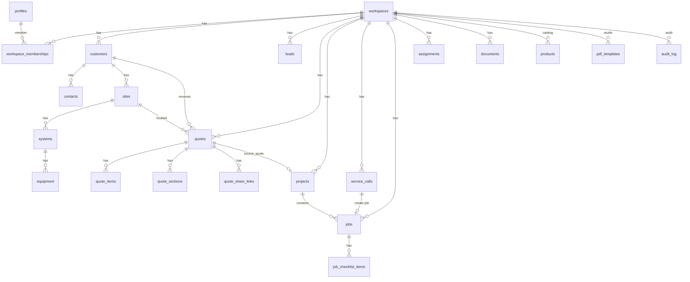

# SITE SECURE — Codebase Snapshot (Implementation Audit)

**Audience:** external senior architect planning a Flutter-template *visual* redesign of the existing web UI.  
**Scope:** current working tree. Read-only. No secrets.  
**Rule:** planned / V3 / docs-only features are labeled as such. Implementation wins over `Docs/`.

**Observed version strings (they do not agree):**

| Surface | Value | Source |
|---|---|---|
| FastAPI app | `0.7.0` | `apps/api/app/main.py` |
| Web npm package | `0.1.1` | `apps/web/package.json` |
| In-app version constant | `0.1.6-beta` | `apps/web/src/lib/app-version.ts` |
| Authz catalog | `version: 1` | `packages/authz/catalog.json` |
| CCTV sizing engine | `1` | `apps/web/src/lib/cctv-sizing/types.ts` |

---

## 1. Executive summary

SITE SECURE is a **Hebrew-first, RTL, multi-tenant SaaS operating system for Israeli installation / security / field-service companies**. It is not a generic CRM. The live product is a **Vite React SPA + FastAPI BFF + Supabase (Postgres/Auth/Storage/RLS)**. There is **no Flutter app, no `apps/mobile` tree, and no native Maps/Workforce/GPS product**.

**Primary users (roles in `packages/authz/catalog.json`):**

| Role | Home | Commercial quotes/catalog | Field |
|---|---|---|---|
| `owner` | Ops dashboard | full (`*` grants) | yes |
| `administrator` | Ops dashboard | full except billing | yes |
| `manager` | Ops dashboard | full operational | assign/start/complete |
| `sales` | Sales dashboard | quotes yes, no `quotes.view_cost` | view only |
| `technician` | Today (`/app/today`) | **denied** quotes/catalog | assigned jobs only |
| `viewer` | Observe dashboard | view quotes/catalog | view |

`founding_technician` remains in catalog `seat_buckets` but is retired as an authz role (migration `20260908210000_retire_founding_technician_role.sql`).

**Main live workflows**

1. Auth (Supabase) → FastAPI `/auth/session` → workspace membership → `/app`.
2. CRM: customer → site → system/equipment → documents.
3. Lead → quote (CPQ builder) → PDF / public share / approve-sign → optional project-from-quote.
4. Catalog + CCTV recommend → quote lines.
5. Service call → field job → assign → technician Today → en route / arrived / start / checklist / photo → complete.
6. Workspace settings, custom roles, PDF Template Studio, platform admin.

**Maturity:** operational beta-grade web product. Quotes/CPQ, catalog, CCTV recommend, PDF, CRM, dispatch, entitlements, and platform admin are implemented in code. Calendar is a **task list**, not a scheduler. Knowledge/warranties are thin CRUD. Inspections, Workforce Schedule, SITE AI, in-app Maps, GPS, inventory UI, finance UI are **not product modules** (some exist only as V3 capability registry keys).

**Architecture**

```
Browser (RTL SPA, TanStack Router)
  ├─ Supabase Auth (anon key, session JWT)
  └─ FastAPI /api/v1  (Bearer JWT)
        └─ PostgREST + Auth + Storage with *user* JWT (RLS)
              └─ Postgres (workspace_id tenant)
```

**Frontend stack:** React 19, TypeScript, Vite 6, TanStack Router 1.92, TanStack Query 5, Tailwind CSS 4, Zod 3, Lucide, ApexCharts 7, pdfjs-dist 4, Lottie, `@supabase/supabase-js` ^2.47. Workspace packages: `@site-secure/ui`, `design-system`, `api-client`, `authz`.

**Backend stack:** FastAPI ≥0.115, Pydantic v2, httpx, python-dotenv, fpdf2 + uharfbuzz (Hebrew PDF), openpyxl (catalog import), python-multipart. Python ≥3.12. No Celery/Redis/RQ found.

**Database:** Supabase Postgres project ref `rhxqqudlngimhplvndmz` (documented V2; not V1 `flukzgqflaikmddeoica`). Schema-as-code under `supabase/migrations/` (~63 SQL files). RLS + `SECURITY DEFINER` helpers (`auth_is_member`, `auth_assigned`, `my_workspace_entitlements`, …).

**Auth:** Supabase Auth in the browser. API validates JWT via `/auth/v1/user` and queries PostgREST with that JWT. Service role is API-only and rejected if used as a user token (`UserClient`).

**Authorization:** server `authorize()` in `apps/api/app/authz/engine.py` is authoritative. UI `can()` is a hide/show gate only. Features come from plan entitlements RPC; workspace custom roles from `workspace_rbac.py`. Technician scope is `assigned`.

**Deployment (as coded/documented):**

- Web: Vercel SPA (`npm run web:build` → `apps/web/dist`). FastAPI is **not** on Vercel.
- API: separate host / Docker (`deploy/Dockerfile.api`, `deploy/compose.staging.yml`).
- Shared Supabase V2.

**Major third-party:** Supabase, Vercel (web), Google Maps *search URL only* (not an embedded map SDK), npm registry packages listed above.

---

## 2. Repository structure

Monorepo. npm workspaces: `apps/web`, `packages/*`. API is Python, not an npm workspace.

```
SiteSecureV1/
├── apps/
│   ├── web/                      Vite React SPA
│   │   ├── src/
│   │   │   ├── routes/           TanStack file routes (source of truth for URLs)
│   │   │   ├── components/       screens + feature UI
│   │   │   ├── lib/              session, can, quotes, CCTV, nav, theme
│   │   │   ├── i18n/             he.ts (product), public-he.ts
│   │   │   └── styles.css        ~10k lines of product CSS
│   │   ├── tests/                Vitest
│   │   └── vercel-env/           hosted env isolation
│   └── api/                      FastAPI
│       ├── app/                  application package
│       │   ├── routers/          HTTP
│       │   ├── authz/            engine, catalog, scope, guard
│       │   ├── documents/        company/PDF document model
│       │   ├── cctv_recommend/   catalog resolution on top of sizing
│       │   ├── cctv_sizing/      Python sizing (parity with TS)
│       │   └── catalog_import/
│       └── tests/
├── packages/
│   ├── ui/                       Button, Field, Table, Overlay, Feedback
│   ├── design-system/            tokens.css + tokens.json
│   ├── api-client/               browser fetch client (createApiClient)
│   ├── authz/                    catalog.json (roles/grants/plans)
│   └── types/                    generated DB types (partial)
├── supabase/
│   ├── migrations/               ordered SQL
│   ├── seed/
│   ├── functions/                NOT VERIFIED as the live authz path (API uses Python)
│   └── config.toml               local project_id site-secure-v2
├── Docs/                         product/architecture (may lag code)
├── deploy/                       Dockerfiles, compose.staging.yml, vercel.json sibling at root
├── lottiefiles/                  source Lottie JSON
└── package.json                  engines.node >=20, .nvmrc = 20
```

**Not present as product code:** `apps/mobile`, `services/`, Flutter, a Maps app, a Workforce scheduler.

**Ignore for architecture:** `node_modules/`, `dist/`, `.cache/`, `_qa_local_archive/`, screenshot folders under `apps/web/scripts/_*/`.

**Directory responsibilities**

| Path | Responsibility |
|---|---|
| `apps/web/src/routes` | URL map, page composition, permission wrappers |
| `apps/web/src/components` | Layout, dashboards, CPQ, field job, settings chrome |
| `apps/web/src/lib` | Client business helpers (must not be treated as authority vs API) |
| `packages/ui` | Restyle-safe primitives |
| `packages/api-client` | Typed HTTP; keep across a UI rewrite |
| `packages/authz` | Shared catalog copy; server also loads this JSON |
| `apps/api/app` | Authoritative business logic |
| `supabase/migrations` | Tenant schema, RLS, RPCs |

---

## 3. Frontend architecture

| Concern | Implementation |
|---|---|
| Framework | React 19 (`createRoot`, StrictMode) |
| Language | TypeScript, `moduleResolution: bundler` |
| Bundler | Vite 6 + `@vitejs/plugin-react` + Tailwind 4 Vite plugin + TanStack router plugin |
| Routing | TanStack Router file routes → `apps/web/src/routeTree.gen.ts` (generated) |
| State | React state + TanStack Query. No Redux/Zustand. Session via React context |
| API client | `createApiClient` in `packages/api-client/src/index.ts`; injected as `session.api` |
| Auth handling | `apps/web/src/lib/supabase.ts` + `session.tsx` (`onAuthStateChange` → `api.getSession()`) |
| Authorization UI | `can()` / `RequirePermission` / `Can` / nav filters. **Not authoritative** |
| Styling | Tailwind 4 utility classes **plus** a large `styles.css` of custom classes |
| Component library | `@site-secure/ui` (internal), not MUI/Chakra/shadcn |
| Icons | `lucide-react` |
| Charts | `apexcharts` + `react-apexcharts` (`CommercialPulseChart`) |
| Forms | native `<form>` / controlled inputs; not React Hook Form |
| Validation | Zod on some client paths; **server Pydantic + FastAPI** is authoritative |
| Tables | `@site-secure/ui` `Table` + `ModuleKit.SimpleEntityTable` + many custom tables |
| Dialogs | `Modal`, `Drawer`, `Dropdown` in `packages/ui/src/Overlay.tsx`; many feature sheets |
| Toasts | `ToastViewport` exists in UI package; product also uses inline errors / save indicators |
| PDF | `pdfjs-dist` preview (`PdfDocumentPreview`); download via API blob helpers |
| Responsive | CSS `lg:` (~1024) for shell; `md:` / `768px` for several modules; quote CPQ has dedicated mobile bars |
| Mobile | responsive web + bottom nav; **not** a PWA service worker (NOT VERIFIED as installed) |
| Theme | light / dark / system (`site-secure-theme` localStorage); `html.dark` |
| i18n | Hard-coded Hebrew in `he.ts`. `dir="rtl"` on `<html>`. Latin/LTR via `.ltr-meta` |
| Fonts | Heebo (Hebrew), Inter, JetBrains Mono (`@fontsource-variable/*`) |

**Boot:** `main.tsx` → `AppErrorBoundary` → `QueryClientProvider` → `SessionProvider` → `RouterProvider`. Root route mounts `ThemeRuntime`.

**Dev API:** Vite proxies `/api` to `VITE_API_URL` (default `http://localhost:8000`). Production requires a non-localhost `VITE_API_URL` unless hosted empty-proxy mode.

**Important frontend files**

- `apps/web/src/main.tsx`, `routes/__root.tsx`, `routes/app/route.tsx`
- `apps/web/src/lib/session.tsx`, `supabase.ts`, `can.ts`, `app-nav.ts`, `home.ts`
- `apps/web/src/components/AppShell.tsx`, `AppSidebar.tsx`, `AppBottomNav.tsx`
- `apps/web/src/components/quotes/QuoteBuilder.tsx` (~2400 lines)
- `apps/web/src/lib/cctv-sizing/*`
- `apps/web/src/styles.css`, `packages/design-system/src/tokens.css`

---

## 4. Design system

**Central tokens:** `packages/design-system/src/tokens.css` (`@theme`) and `tokens.json`.

| Token | Light (product) |
|---|---|
| Action | `#0b6bcb` |
| FG | `#0f172a` |
| FG muted | `#475569` |
| Border | `#d8dee8` |
| BG / subtle / canvas | `#ffffff` / `#f4f6f9` / `#eef1f5` |
| Danger / warning / success | `#b42318` / `#b54708` / `#067647` |
| Radius control / panel | `6px` / `8px` |
| Spacing base | `4px` (`p-1`=4 … `p-16`=64) |
| Shadow card / popover | hairline vs `0 8px 24px` |
| Fonts | Heebo + Inter; JetBrains Mono for LTR meta |

**Dark mode:** `.dark` in the same file — graphite, not neon. Auth screens use `.auth-root` / `.auth-shell` (always dark console). Public quote/legal uses `.public-root`.

**Primitives (`packages/ui`):**

| Kind | File | Notes |
|---|---|---|
| Button | `Button.tsx` | `primary\|secondary\|ghost\|danger`, loading spinner |
| Inputs | `Field.tsx` | `Input`, `Select`, `Textarea`, `FieldShell` |
| Controls | `Controls.tsx` | Checkbox, Radio, Switch |
| Display | `Display.tsx` | Badge, Card, Status |
| Table | `Table.tsx` | unstyled-ish semantic table |
| Overlay | `Overlay.tsx` | Modal, Drawer, Dropdown, Tooltip, ToastViewport |
| Feedback | `Feedback.tsx` | EmptyState, ErrorState, LoadingBlock, Skeleton, SuccessState |
| Header/tabs | `TabsHeader.tsx` | PageHeader, Tabs |

**Not fully centralized.** Large screens add CSS in `apps/web/src/styles.css` (ops-shell, quote-builder, field-job, settings-panel, admin-shell, auth, public). Redesigning only `tokens.css` will **not** restyle those screens.

**Navigation chrome:** `AppShell` + `AppSidebar` + `AppBottomNav` + `MobileMoreSheet` + `MobileWorkSheet`. Collapse state: `localStorage` key `site-secure-sidebar-collapsed`.

**Breakpoints (as used, not a published scale):**

- Shell sidebar vs bottom nav: Tailwind `lg` (1024px) in `AppShell.tsx`.
- Many module layouts: `768px` / `md`.
- Quote mobile action bar / sheet: `lg:hidden`.

**Loading / empty / error:** `@site-secure/ui` Feedback primitives; dashboard has `DashboardSkeleton`; modules use `ModuleKit.EmptyRows`.

---

## 5. Complete route / screen inventory

Permission column is the **UI gate**. API still enforces `authorize()`.

| Route | Component | Purpose | Primary user | Main actions | API | UI permission | Mobile | UI complexity | Notes |
|---|---|---|---|---|---|---|---|---|---|
| `/` | `routes/index.tsx` + `PublicHome` | Marketing/public home | anonymous | CTA to login/register | none | public | GOOD | medium | Dark public DNA |
| `/login` | `login.tsx` / `LoginForm` | Sign in | all | password login | Supabase Auth | public | GOOD | medium | Auth dark shell |
| `/register` | `register.tsx` | Sign up | new | register | Supabase Auth | public | GOOD | medium | |
| `/forgot-password` | `forgot-password.tsx` | Reset request | all | email reset | Supabase Auth | public | GOOD | low | |
| `/reset-password` | `reset-password.tsx` | Set new password | all | update password | Supabase Auth | public | GOOD | low | |
| `/verify-email` | `verify-email.tsx` | Confirm / resend | new | resend | `supabase.auth.resend` | public | GOOD | low | |
| `/onboarding` | `onboarding.tsx` / `OnboardingForm` | Create first workspace | new owner | create workspace | `POST /workspaces` | authenticated | USABLE | medium | |
| `/invite/$token` | `invite/$token.tsx` | Accept invite | invitee | accept | `/invitations/peek`, `/accept` | public+auth | USABLE | medium | |
| `/legal`, `/legal/$slug` | legal routes | Legal docs | public | read | none | public | GOOD | low | |
| `/public/quotes/$token` | `public/quotes/$token.tsx` | Customer quote portal | customer | review, sign, reject, PDF | `/api/v1/public/quotes/*` | token | USABLE | high | Dark public |
| `/q/$token` | `q/$token.tsx` | Short quote link | customer | alias | public quotes | token | USABLE | low | |
| `/app` | `app/route.tsx` | Auth shell + boot animation | member | — | `GET /auth/session` | session+workspace | — | — | Redirects guests |
| `/app/` | `app/index.tsx` | Role home redirect | member | — | — | `dashboard.view` | — | — | today vs dashboard |
| `/app/dashboard` | `dashboard.tsx` + `OpsDashboard` | Ops/sales/observe home | owner/admin/manager/sales/viewer | create, attention, KPIs | `GET .../dashboard` | `dashboard.view` | USABLE | **high** | Technicians redirected away |
| `/app/today` | `today.tsx` + `TodayHome` | Technician day board | technician | en_route, arrived, open job | dashboard + job actions | `dashboard.view` + today variant | USABLE | high | Non-tech redirected to dashboard |
| `/app/tasks` | `tasks/index.tsx` | Task list (labeled Calendar in nav) | office/field | create, mark done | `/tasks` | `calendar.view` | USABLE | **low** | **Not a calendar UI** |
| `/app/customers` | `customers/index.tsx` | Directory | CRM roles | search, create | `/customers` | `crm.view` + feature `crm` | USABLE | medium | |
| `/app/customers/$customerId` | `$customerId.tsx` + `CustomerProfile` | Customer 360 | CRM | edit, sites, quotes | customers, sites, quotes | `crm.view` | POOR–USABLE | high | Dense 360 |
| `/app/leads` | `leads/index.tsx` | Lead list + new sheet | sales/ops | create, convert | `/leads` | `leads.view` | USABLE | medium | `?new=1` quick action |
| `/app/leads/$leadId` | `$leadId.tsx` + `LeadProfile` | Lead detail | sales | edit, schedule visit sheet | `/leads/{id}` | `leads.view` | USABLE | medium | |
| `/app/quotes` | `quotes/index.tsx` + `QuotesWorkspace` | Quote list/tabs | sales/ops | open, new | `/quotes` | `quotes.view` + feature `quotes` | USABLE | high | |
| `/app/quotes/new` | `quotes/new.tsx` | Create quote | sales/ops | create | `POST /quotes` | `quotes.create` | USABLE | medium | |
| `/app/quotes/$quoteId` | `$quoteId.tsx` + **QuoteBuilder** | CPQ builder | sales/ops | edit, send, PDF, share, CCTV | quotes + cpq + cctv + catalog | `quotes.view` | POOR (usable with mobile bars) | **very high** | Core money UI |
| `/app/quotes/$quoteId.preview` | `$quoteId.preview.tsx` | Internal preview | sales/ops | preview | `/quotes/{id}/preview` | `quotes.view` | USABLE | medium | |
| `/app/catalog` | `catalog.tsx` | Products, import, bulk price | ops | CRUD, import wizard | `/catalog/*` + import | `catalog.view` | POOR | high | Cost columns gated |
| `/app/projects` | `projects/index.tsx` | Project list | ops | create | `/projects` | `projects.view` | USABLE | low–medium | ModuleKit |
| `/app/projects/$projectId` | `$projectId.tsx` | Project detail | ops | patch status | `/projects/{id}` | `projects.view` | USABLE | medium | |
| `/app/sites` | `sites/index.tsx` | Site list | ops/field | create | `/sites` | `sites.view` | USABLE | low–medium | |
| `/app/sites/$siteId` | `$siteId.tsx` + `SiteDossier` | Site file | ops/field | systems, docs, equipment | sites, systems, equipment, documents | `sites.view` | POOR–USABLE | high | |
| `/app/service` | `service/index.tsx` | Service calls + create job | ops/tech | create call, create job | `/service-calls`, `/create-job` | `service.view` | USABLE | medium | |
| `/app/jobs/$jobId` | `$jobId.tsx` + `FieldJob` | Field execution | technician/manager | lifecycle, checklist, photo | `/jobs/*`, documents | `jobs.view` | USABLE | high | |
| `/app/warranties` | `warranties/index.tsx` | Warranty list | ops | issue | `/warranties` | `warranties.view` | USABLE | low | Thin CRUD |
| `/app/knowledge` | `knowledge/index.tsx` | Articles | ops | create | `/knowledge` | `knowledge.view` | USABLE | low | Thin CRUD |
| `/app/settings` | settings index + `SettingsShell` | Workspace general | admin | patch workspace | `/workspaces/{id}`, settings | `workspace.edit` | USABLE | medium | Nested nav |
| `/app/settings/company` | `company.tsx` | Branding / logo | admin | logo upload, profile | company-profile, documents | branding/edit | USABLE | medium | |
| `/app/settings/appearance` | `appearance.tsx` | Theme picker | admin | light/dark/system | none (localStorage) | `workspace.edit` | GOOD | low | |
| `/app/settings/numbering` | `numbering.tsx` | Prefix prefs | admin | save JSON settings | `/settings` | `workspace.edit` | GOOD | low | |
| `/app/settings/quotes` | `quotes.tsx` | Quote defaults | admin | save | `/settings` | `workspace.edit` | GOOD | low | |
| `/app/settings/pdf-templates` | `pdf-templates.tsx` | PDF Studio | admin | CRUD, preview | `/pdf-templates*` | `workspace.edit` | POOR | **high** | Desktop-oriented |
| `/app/settings/sites` | `sites.tsx` | Site defaults | admin | save | `/settings` | `workspace.edit` | GOOD | low | |
| `/app/settings/notifications` | `notifications.tsx` | Pref toggles | admin | save JSON | `/settings` | `workspace.edit` | GOOD | low | **No mailer shown** |
| `/app/settings/users` | `users.tsx` | Members / invites | admin | invite, role patch | `/members`, invitations | `users.view` | USABLE | medium | |
| `/app/settings/roles` | `roles.tsx` | Custom RBAC | Pro+ | create/patch grants | `/roles` | `roles.manage` | POOR | high | Feature-gated `team` |
| `/app/settings/security` | `security.tsx` | Security center | admin | view | `/security` | settings.general or workspace.edit | USABLE | medium | |
| `/app/settings/system` | `system.tsx` | System status | admin | view | usage/settings | `workspace.edit` | USABLE | low | |
| `/app/settings/audit` | `audit.tsx` | Audit log | admin | list | `/audit` | `audit.view` | USABLE | medium | |
| `/admin` | `admin/index.tsx` | Platform home | platform admin | — | `/api/v1/admin/summary` | `is_platform_admin` | USABLE | medium | Separate shell |
| `/admin/organizations` | `organizations.tsx` | Tenant list | platform | patch org | admin orgs | platform | POOR | medium | |
| `/admin/users` | `users.tsx` | Global users | platform | — | admin users | platform | POOR | medium | |
| `/admin/beta` | `beta.tsx` | Beta participants | platform | enroll | `/beta/participants` | platform | USABLE | medium | |
| `/admin/badges` | `badges.tsx` | Recognition badges | platform | patch | `/users/{id}/badges` | platform | USABLE | low | |
| `/admin/feedback` | `feedback.tsx` | Feedback queue | platform | patch | admin feedback | platform | USABLE | medium | |
| `/admin/audit` | `audit.tsx` | Platform audit | platform | list | admin audit | platform | USABLE | medium | |
| `/admin/flags` | `flags.tsx` | Feature flags | platform | toggle | feature-flags | platform | USABLE | low | |
| `/dev/ui` | `dev/ui.tsx` | UI kit playground | dev | — | none | **NOT VERIFIED** if gated in prod | n/a | low | |

**No routes found for:** Maps, Workforce Schedule, GPS tracking, Inspections product, SITE AI chat, Inventory, Finance, Accounting documents UI, native calendar/week view.

---

## 6. Component inventory

### Layout / navigation (redesign affects every authenticated screen)

| Component | Path | Responsibility | Reuse | Redesign blast radius |
|---|---|---|---|---|
| `AppShell` | `components/AppShell.tsx` | Desktop sidebar + mobile bottom + command palette + account | layout | **entire /app** |
| `AppSidebar` | `AppSidebar.tsx` | Grouped nav | layout | all desktop /app |
| `AppBottomNav` | `AppBottomNav.tsx` | 5-tab spine | layout | all mobile /app |
| `MobileMoreSheet` | `MobileMoreSheet.tsx` | Overflow IA | layout | mobile |
| `MobileWorkSheet` | `MobileWorkSheet.tsx` | Work destinations | layout | mobile |
| `UserAccountMenu` | `UserAccountMenu.tsx` | Account / settings / admin / sign out | global | all |
| `SettingsShell` | `settings/SettingsShell.tsx` | Settings subnav | settings | all settings |
| `CommandPalette` | `CommandPalette.tsx` | ⌘K navigation | global | all /app |
| `AppErrorBoundary` | `AppErrorBoundary.tsx` | Crash UI | global | all |
| `FeedbackCenter` | `FeedbackCenter.tsx` | In-app feedback | global | all + admin |

### Global / shared (mostly SAFE TO RESTYLE)

`packages/ui` primitives; `Can.tsx`; `RequirePermission.tsx`; `ModuleKit.tsx` (scaffold for thin modules); `ThemePicker.tsx`; `NavIcon.tsx`; `BetaBadge.tsx`; `FoundingTechnicianBadge.tsx`; lottie wrappers; `PdfDocumentPreview.tsx`.

### Feature components (coupling varies)

| Component | Path | Used by | Notes |
|---|---|---|---|
| `OpsDashboard` / `ObserveDashboard` | `dashboard/OpsDashboard.tsx` | `/app/dashboard` | Composes many dashboard widgets |
| `TodayHome` / `TodayList` | `dashboard/Today*` | `/app/today` | Consumes dashboard payload + job actions |
| `QuoteBuilder` | `quotes/QuoteBuilder.tsx` | quote detail | **HIGH RISK** — CPQ + CCTV + PDF + send |
| `QuotesWorkspace` | `quotes/QuotesWorkspace.tsx` | quote list | tabs/filters |
| `QuoteLinesPanel` / `QuoteLineRow` | `quotes/cpq/*` | builder | line math display; server totals win |
| `SystemBuilderDrawer` | `quotes/cpq/SystemBuilderDrawer.tsx` | builder | CCTV recommend UX |
| `FieldJob` | `field/FieldJob.tsx` | `/app/jobs/$jobId` | lifecycle + evidence |
| `CustomerProfile` / `CustomerDirectory` | `customers/*` | CRM | 360 |
| `SiteDossier` | `sites/SiteDossier.tsx` | site detail | systems/docs |
| `CatalogImportWizard` / `CatalogBulkPricing` | `catalog/*` | catalog | import is high logic |
| `QuoteDocument` / `SignaturePad` | `quotes/document`, `SignaturePad` | public + preview | customer legal UX |
| Auth suite | `components/auth/*` | login/register | visual is isolated (`.auth-root`) |

---

## 7. Current navigation

**Desktop (`appNav`):** groups Overview, Sales, Ops, System. Items filtered by `can()` + plan `features`. Technician home item is Today, not Dashboard. Settings appears if any of `workspace.edit | users.view | roles.manage | settings.general | audit.view`.

**Mobile bottom spine (`bottomNav`, max 5):** בית (home) · לקוחות · עבודה (sheet) · משימות · עוד (sheet).

**Work sheet:** Today (for office roles), Projects, Service, Sites — live routes only.

**More sheet:** sales extras (leads/quotes/catalog), warranties/knowledge, settings.

**Settings nested:** general, company, appearance, numbering, quotes, PDF, sites, notifications, users, roles, security, system, audit — each permission-filtered.

**Admin:** independent `admin-shell` nav (orgs, users, beta, badges, feedback, audit, flags). Requires `session.is_platform_admin`, not a workspace role.

**Role differences (examples):**

- Technician: no Quotes/Catalog nav (`quotes.view` / `catalog.view` absent). Home = Today.
- Sales: dashboard variant `sales`; no cost permission.
- Viewer: observe dashboard; no mutation actions on dashboards (server + UI).

---

## 8. Feature / module inventory

Status is **code vs routes vs API vs schema**, not roadmap slides.

| Module | Status | Evidence |
|---|---|---|
| Auth / session / onboarding / invites | **IMPLEMENTED** | routes + Supabase + `/auth/session` |
| Dashboard (ops/sales/observe) | **IMPLEMENTED** | `/dashboard` + widgets |
| Technician Today | **IMPLEMENTED** | `/today` + job actions |
| Customers / contacts | **IMPLEMENTED** | CRUD API + UI |
| Sites / systems / equipment | **IMPLEMENTED** | routers `sites.py`, `systems.py` + SiteDossier |
| Documents / storage upload | **IMPLEMENTED** | intent → PUT → complete |
| Leads | **IMPLEMENTED** | ops_modules + LeadProfile |
| Quotes / CPQ | **IMPLEMENTED** | large surface |
| Catalog + import + bulk pricing | **IMPLEMENTED** | catalog + catalog_import |
| CCTV sizing + recommend | **IMPLEMENTED** | TS engine + Python recommend API |
| PDF quote + Template Studio | **IMPLEMENTED** | fpdf2 + pdf-templates routes |
| Public quote approve/sign | **IMPLEMENTED** | public router + SignaturePad |
| Projects + from-quote | **IMPLEMENTED** | ops_modules |
| Service calls + create-job | **IMPLEMENTED** | service UI + jobs |
| Jobs / dispatch lifecycle | **IMPLEMENTED** in API/UI; see migrations note | jobs router + FieldJob |
| Tasks (“calendar”) | **PARTIAL** | CRUD list, not calendar |
| Warranties | **PARTIAL** | thin list/create |
| Knowledge | **PARTIAL** | thin list/create |
| Team / users / invites | **IMPLEMENTED** | settings/users |
| Custom roles | **IMPLEMENTED** | settings/roles + workspace_rbac |
| Security center | **IMPLEMENTED** | `/security` |
| Audit | **IMPLEMENTED** | workspace + platform |
| Usage / quotas | **IMPLEMENTED** | `/usage`, quota errors |
| Feedback | **IMPLEMENTED** | FeedbackCenter + admin |
| Feature flags | **IMPLEMENTED** | admin flags; consumption NOT fully mapped in this audit |
| Platform admin | **IMPLEMENTED** | `/admin/*` |
| Search | **IMPLEMENTED** API (`/search`); command palette is nav-heavy | NOT VERIFIED as full global search UX |
| Notifications settings | **PARTIAL** | JSON prefs only; no email provider in API |
| Inventory | **PLANNED / NOT IMPLEMENTED** as UI | feature key + grants only |
| Finance / accounting docs | **PARTIAL** backend document formatters exist; **no finance screens** | `app/documents/*` |
| Reports | **NOT IMPLEMENTED** UI | permission keys only |
| Automation | **NOT IMPLEMENTED** | feature key |
| Maps product | **NOT IMPLEMENTED** | only `mapsSearchUrl` → Google |
| GPS tracking | **NOT IMPLEMENTED** | no routes/API |
| Workforce Schedule / skills | **NOT IMPLEMENTED** | V3 capability keys only |
| Inspections | **NOT IMPLEMENTED** | V3 capability keys only |
| SITE AI | **NOT IMPLEMENTED** | V3 `site_ai.*` keys only |
| Native mobile / Flutter | **NOT IMPLEMENTED** | no app |

**Docs discrepancy:** `app-nav.ts` `TARGET_IA` marks `calendar` as `live`. The live route is a task list. Treat calendar scheduler as **not implemented**.

---

## 9. Backend architecture

**Framework:** FastAPI (`create_app()`), title `SITE SECURE V2 API`.

**Structure:** single process, router modules, no separate microservice tree.

**API shape:** almost all tenant APIs are `/api/v1/workspaces/{workspace_id}/...`. Exceptions: `/api/v1/auth/*`, `/workspaces`, invitations, `/admin`, `/public/quotes`, `/telemetry`, `/health`, `/feedback`.

**Middleware:** CORS from settings; in-process rate limit (~120 req/min/IP); `X-Request-Id`; JSON `ApiError` envelope `{error:{code,message,details}}`.

**Authentication:** `bearer_token` → `UserClient(settings, jwt)` → `get_user()` against Supabase Auth. Service-role JWT cannot be used as a user (`401`).

**Authorization:** `load_authz_context` then `authorize()` then `require()`. Scope filters for technicians in list endpoints (`authz/scope.py`). Catalog strip of cost for roles without `quotes.view_cost`.

**Tenant:** every row has `workspace_id`. RLS uses `auth.uid()` membership. API never “trusts” a workspace id in the path without membership/context load.

**Validation:** Pydantic models `extra="forbid"` on many writes.

**Background jobs:** **none found** (no Celery/Redis/cron workers in-repo). Work is request-synchronous.

**Files:** upload protocol in `documents.py` (create upload intent, client PUT to signed URL, complete). Storage is Supabase Storage.

**PDF:** `quote_pdf.py` (fpdf2 + HarfBuzz), company document formatters, template preview endpoints.

**Email:** no SendGrid/SMTP/Postmark client in `apps/api`. Quote “send” is product-state + share link + audit. Inbox verify uses Supabase Auth resend.

**Logging:** stdlib logger `site-secure` with path/status/latency.

**Auditing:** `write_audit` on sensitive quote/member actions; `site_timeline.py` for site events; table `audit` (migration `0022_audit.sql`).

**Integrations:** Supabase only as a platform. Google Maps is a URL. No Stripe/billing integration found in API routers.

**Important backend files:** `main.py`, `deps.py`, `http_supabase.py`, `supabase_user.py`, `authz/engine.py`, `workspace_rbac.py`, `pricing.py`, `job_lifecycle.py`, `quote_pdf.py`, `quote_snapshot.py`, `dashboard.py`, `routers/*.py`.

---

## 10. API inventory

All authenticated workspace routes require `Authorization: Bearer <user JWT>` and pass `authorize()`.

| Group | Prefix | Purpose | Frontend |
|---|---|---|---|
| Health | `/health`, `/api/v1/health` | liveness | probes |
| Auth | `/api/v1/auth/session`, `/me`, `/authz/catalog` | session, profile, catalog | `session.tsx` |
| Workspaces | `/api/v1/workspaces` | create/get/patch, invites | onboarding, settings, invite |
| Dashboard | `.../dashboard` | today/ops payload | dashboard, today |
| Customers | `.../customers` | CRM | customers |
| Sites | `.../sites` | sites | sites, customer 360 |
| Systems/equipment | `.../systems`, `.../equipment` | installed base | SiteDossier, FieldJob |
| Search | `.../search` | workspace search | command/search (partial) |
| Jobs | `.../jobs` + en-route/arrived/start/complete/assign/checklist | dispatch | Today, FieldJob, service |
| Ops | `.../leads`, `projects`, `service-calls`, `warranties`, `tasks`, `knowledge` | modules | corresponding routes |
| Quotes | `.../quotes` | lifecycle, items, send, share, revise | QuoteBuilder |
| Quote CPQ | sections, packages, margin-override, versions, events, document, pdf | CPQ | QuoteBuilder |
| Catalog | products, categories, templates, bulk-pricing | catalog | catalog |
| Catalog import | `.../catalog/import/*` | parse/preview/commit | CatalogImportWizard |
| CCTV | `POST .../cctv/recommend` | size + pick catalog | SystemBuilderDrawer |
| Documents | uploads/complete/url | evidence + logos | FieldJob, company, sites |
| Team | members, usage, audit, security | settings | users, audit, security |
| Settings | settings, company-profile, roles, pdf-templates | admin UX | settings/* |
| Public quotes | `/api/v1/public/quotes/{token}` | unauthenticated customer | public portal |
| Admin | `/api/v1/admin/*` | platform | `/admin` |
| Feedback/flags | `/api/v1/feedback`, `/feature-flags` | beta | FeedbackCenter |
| Telemetry | `/api/v1/telemetry/client-error` | client errors | error boundary (NOT VERIFIED every call site) |

**Frontend consumer:** almost exclusively `packages/api-client` methods (`getDashboard`, `createQuote`, `enRouteJob`, …). The SPA does **not** talk to PostgREST directly for business writes.

---

## 11. Database / data model

Tenant root is `workspaces`. Users are `auth.users` + `profiles`. Access is `workspace_memberships` (`role_key`, optional `workspace_role_key`).



**Workspace boundary:** every business table includes `workspace_id`. Cross-tenant access is denied by RLS (live tests exist in `test_tenant_isolation.py`). Path workspace id is additionally checked in API context load.

**Core quote money columns (server-owned):** `subtotal_net`, `vat_amount`, `total_gross`, `cost_total`, `margin_*`. Client cannot dictate totals (`pricing.recalculate`).

**Job statuses in code:** `scheduled | en_route | arrived | in_progress | completed | cancelled | blocked`. `arrived`/`blocked` added in migration `0051`. **Remote apply of 0051–0053 is NOT VERIFIED in this file-only audit.** Files exist:

- `0051_job_dispatch_lifecycle.sql` — enum values + `arrived_at`, `scheduled_end`, `priority`
- `0052_assignment_history.sql` — `unassigned_at`/`unassigned_by`, partial unique, `auth_assigned` ignores closed rows
- `0053_service_call_numbers.sql` — `service_calls.number` `SR-#####`

---

## 12. Authentication + RBAC

**Login flow**

1. Browser `supabase.auth.signIn*` (`LoginForm`).
2. JWT stored via `authTokenStorage` (`remember-device`).
3. `SessionProvider` calls FastAPI `GET /api/v1/auth/session`.
4. Session returns profile + **memberships[0] as active workspace** (ordered, prefers `last_workspace_id`).
5. `/app` requires `user` + `has_workspace`. Else onboarding/login.

**There is no workspace switcher UI** in `session` comments: `memberships[0]` is the active workspace.

**Authoritative authorization:** `apps/api/app/authz/engine.py` `authorize()`.

Pipeline: authenticated → tenant active → subscription status ∈ {trialing, active, manual} → feature included → grant (catalog or workspace custom `ctx.grants`) → **scope** → resource state (quote locked, job complete, …) → invite business rules.

**Scopes:** owner/admin `all`; manager `team` (treated as all in `_scope_ok`); sales `owned`; technician `assigned`; viewer `all` but grants are read-only.

**Features:** `my_workspace_entitlements` RPC (migrations `0028`, `0041`). Fail closed if RPC fails (`deps.parse_entitlements_rpc`).

**Workspace overrides:** custom roles table + `resolve_role_grants`. Plan `solo` cannot use custom RBAC the same way as Pro (`roles.manage` gated on feature `team`).

**Frontend guards:** `RequirePermission` uses `can(role, perm, features, session.permissions)`. **`Can.tsx` does not pass `permissions`** — custom workspace grants may not hide `Can`-wrapped controls. Navigation does pass permissions.

**Technician commercial isolation:** catalog grants omit `quotes.*` and `catalog.*`. Engine tests assert quotes/catalog deny even when assigned to a job. API strips cost (`_strip_cost` in catalog). Do not restore those grants in a redesign.

**Platform admin:** `profiles.is_platform_admin` → `session.is_platform_admin` / `platform_role`. Separate from workspace roles.

**Relevant files:** `packages/authz/catalog.json`, `apps/api/app/authz/*`, `workspace_rbac.py`, `apps/web/src/lib/can.ts`, `RequirePermission.tsx`, `app-nav.ts`.

---

## 13. Core business flows

### Customer creation — IMPLEMENTED
UI directory/create → `POST /customers` (`crm.create`) → RLS insert.

### Lead → Customer — PARTIAL / IMPLEMENTED via lead fields
Leads can store `customer_id` / `site_id`. Dedicated “convert lead” wizard exists in lead UX (`LeadProfile` / NewLeadSheet) — treat as **implemented at API patch level**; conversion completeness NOT fully traced beyond lead+quote linking.

### Customer → Site — IMPLEMENTED
`POST /sites` with `customer_id`.

### Site → System / equipment — IMPLEMENTED
`POST /systems`, `/equipment`.

### CCTV system design — IMPLEMENTED
Quote builder `SystemBuilderDrawer` → client sizing (`buildCctvRequirements`) + `POST /cctv/recommend` (server catalog pick) → quote lines. See §15.

### Quote creation — IMPLEMENTED
`/app/quotes/new` or dialogs → `POST /quotes` (quota enforced).

### Quote revision — IMPLEMENTED
`POST /quotes/{id}/revise` from sent/viewed/approved/rejected/expired (engine `QUOTE_REVISABLE`).

### Quote → PDF — IMPLEMENTED
`GET .../quotes/{id}/pdf` or document endpoint; fpdf2 RTL; snapshot for historical.

### Quote sharing — IMPLEMENTED
`POST .../share` → public token; `revoke-link`. Customer portal approve/reject with signature.

### Project creation / from quote — IMPLEMENTED
`POST /projects`, `POST /projects/from-quote` (`project_from_quote.py`).

### Service call workflow — IMPLEMENTED
List/create/patch + `POST /service-calls/{id}/create-job` copies customer/site/title/priority/`service_call_id`.

### Technician workflow — IMPLEMENTED in code
Today → job → en_route → arrived → start → checklist/notes/photo → complete (`job_lifecycle.py` + FieldJob). Assign/reassign on jobs API (history intended via 0052).

### Inspection workflow — **NOT IMPLEMENTED**
No routes, no routers. Capability keys only.

---

## 14. CPQ / quote system

**Structure:** `quotes` header + `quote_items` + CPQ `quote_sections` + packages/templates + events + versions.

**Item types:** `catalog | free | labor | note` (enum in `0016_quotes.sql`).

**Statuses:** `draft → sent → viewed → approved | rejected | expired | cancelled`. Edit only in `draft`. Send from `draft`. Delete blocked on `approved` (engine).

**Calculations (authoritative):** `apps/api/app/pricing.py` — line net, header discount (amount/percent), VAT, margin. `POST /recalculate`. Client-supplied totals ignored.

**Taxes:** workspace `vat_percent` (default 18) copied onto quote.

**Packages/templates:** `quote_cpq.py` apply-package, save-as-package/template, `apply-template` on quotes router.

**Validation / readiness:** client `quote-cpq.ts` completeness/gaps; server still decides send.

**PDF / snapshot:** `quote_snapshot.py` public item keys (no cost); `quote_pdf.py` renders; historical snapshots survive brand change (tests exist).

**Sharing:** tokenized public API; signature pad required for approve UX.

**Most important logic files (do not rewrite for a visual pass):**

- `apps/api/app/pricing.py`
- `apps/api/app/routers/quotes.py`, `quote_cpq.py`
- `apps/api/app/quote_pdf.py`, `quote_snapshot.py`
- `apps/web/src/lib/quote-cpq.ts`, `quote-builder.ts` (client UX helpers)
- `QuoteBuilder.tsx` (UI+orchestration — high risk)

---

## 15. CCTV sizing engine

**Where**

- Pure TS: `apps/web/src/lib/cctv-sizing/` (`engine.ts`, `storage.ts`, `recorder.ts`, `poe.ts`, `hdd.ts`, `infrastructure.ts`, `validate.ts`).
- Python parity: `apps/api/app/cctv_sizing/` (tests `test_cctv_sizing_parity.py`).
- Catalog resolution: `apps/api/app/cctv_recommend/` + `POST /cctv/recommend`.

**Inputs:** camera count, indoor/outdoor, MP, retention, recording mode, hours/day, motion duty, codec, bitrate override, PoE flags, cable distance, expansion headroom, optional recorder hint, HDD capacities.

**Outputs:** versioned `CctvEngineeringResult`: recorder tier (4/8/16/32/64), storage TB, HDD pack, PoE budget/ports, infrastructure, compatibility, warnings, unresolved reasons. **No product SKUs in the pure engine.**

**Recommend API** maps requirements onto workspace catalog leaves (camera/NVR/HDD/switch/cable/labor keys), then returns quote-ready lines. Cost stripped without `quotes.view_cost`.

**Frontend integration:** `SystemBuilderDrawer` + `cctv-recommend-projection.ts` into quote lines.

**Do not duplicate engine code into a new UI layer** — call the same TS module and/or API.

---

## 16. PDF system

| Piece | Implementation |
|---|---|
| Quote PDF | `render_quote_pdf` in `quote_pdf.py` (fpdf2, uharfbuzz, bundled fonts under `app/assets/fonts`) |
| RTL | Hebrew via HarfBuzz; LTR isolation for SKU/money (`.ltr-meta` analogue in PDF helpers) |
| Snapshot | `quote_snapshot.py` — public document JSON without internals/cost |
| Preview | `GET /quotes/{id}/preview`, `GET /document` |
| PDF Template Studio | settings routes + `/pdf-templates` CRUD, duplicate, preview |
| Company branding | `company-profile` + logo upload (storage) + document preview |
| Client preview | `pdfjs-dist` in `PdfDocumentPreview.tsx` |
| Historical | templates can be archived (`0045_pdf_template_archived.sql`); snapshot tests for brand change |

Customer-facing PDF must not include cost/margin (snapshot `PUBLIC_ITEM_KEYS`).

---

## 17. Responsive / mobile audit

This is a **responsive web app**, not a native app. `viewport-fit=cover` is set. Bottom nav at `< lg`.

| Screen | Class | Why |
|---|---|---|
| Login / register / public home | **GOOD** | Dedicated auth/public layouts, stacked |
| Dashboard ops | **USABLE** | Many cards; some tables/charts tight at 360 |
| Today | **USABLE** | Built for field; CTAs stacked in CSS for small widths (present in `styles.css`) |
| Field job | **USABLE** | Single column; maps is external link |
| Customers list / leads / service / projects / tasks / warranties / knowledge | **USABLE** | ModuleKit + list/detail; leads has `md:hidden` card list |
| Customer 360 / Site dossier | **POOR** | Dense multi-section desktop dossiers |
| Quote builder | **POOR** (mitigated) | Desktop three-pane DNA; `QuoteMobileActionsBar` + `QuoteMobileSheet` compensate |
| Catalog | **POOR** | Wide product table, cost columns, wizards |
| PDF Studio | **NOT MOBILE READY** | Studio/preview desktop |
| Settings roles | **POOR** | Grant matrix |
| Admin orgs/users | **POOR** | Tables |
| Public quote | **USABLE** | Stepper + sign |

**Patterns to watch in a Flutter-inspired restyle**

- Desktop-only: sidebar, PDF studio, quote aside summary (`QuoteSummaryAside`).
- Overflowing tables: catalog, admin, quotes list, audit.
- Dialogs/drawers: SystemBuilderDrawer, TemplateApplyModal, command palette.
- Touch: ThemePicker already `min-h-11`; many table row actions are not.
- Sidebar dependency: all `/app` pages assume `AppShell`.

---

## 18. UI business-logic coupling

| Class | Examples | Why |
|---|---|---|
| **SAFE TO RESTYLE** | `packages/ui/*`, tokens, auth visual chrome, PageHeader, ModuleScaffold chrome | Presentational |
| **REQUIRES CARE** | `AppShell` / nav (must keep `appNav`/`bottomNav` rules), dashboards (action kinds come from API), FieldJob (status machine mirrored), Catalog (cost visibility), Settings roles | Permission + payload shape |
| **HIGH RISK** | `QuoteBuilder.tsx`, `quote-cpq.ts`, `SystemBuilderDrawer`, `pricing.py` (if touched), `quote_pdf.py`, `authz/engine.py` | Money, PDF, entitlements |

`QuoteBuilder` mixes layout, mutations, CCTV apply, PDF download, send/share, gap scoring. A visual rewrite should **wrap it or split presentational children** without moving calculate/send to the client.

`Can.tsx` vs `RequirePermission` inconsistency is a coupling footgun for custom roles.

---

## 19. Flutter-style redesign compatibility

You can replace **pixels** without replacing **systems**. Recommended boundary:

```
┌─────────────────────────────────────────┐
│ NEW VISUAL LAYER  (Flutter-template look │
│ implemented in React, or later Flutter)  │
│  screens, layout, motion, charts chrome  │
└──────────────┬──────────────────────────┘
               │ session.api  (api-client)
               │ can() only for hiding
┌──────────────▼──────────────────────────┐
│ KEEP UNCHANGED                           │
│  FastAPI, authorize(), pricing,          │
│  job_lifecycle, cctv_recommend,          │
│  quote_pdf/snapshot, RLS, entitlements   │
└─────────────────────────────────────────┘
```

**Keep:** `packages/api-client`, `packages/authz/catalog.json`, all of `apps/api`, `supabase/migrations`, `lib/cctv-sizing` (or call API only), session hydration contract (`SessionResponse`).

**Replace visually:** `AppShell`, sidebar/bottom nav *presentation*, dashboard widgets’ look, ModuleKit styling, quote chrome around existing mutations.

**Do not rewrite:** PostgREST access from the new UI, client-side quote totals as source of truth, technician quote/catalog access, RLS.

A Flutter **app** would still be a new client of the same FastAPI — out of scope for “visual reference in the current SPA,” but the API is already client-agnostic.

---

## 20. Screen redesign priority map

| Current screen | Component | Business criticality | UI complexity | Coupling | Safe to redesign? | Approach |
|---|---|---|---|---|---|---|
| Auth | `auth/*` | high | medium | low | yes | restyle isolated `.auth-root` |
| Ops dashboard | `OpsDashboard` | high | high | medium | careful | restyle widgets; keep `getDashboard` actions |
| Today | `TodayHome` | high | medium | medium | careful | keep action verbs from API |
| Field job | `FieldJob` | high | medium | medium | careful | restyle; keep lifecycle calls |
| Quote list | `QuotesWorkspace` | high | medium | low–med | yes | restyle tabs |
| Quote builder | `QuoteBuilder` | **critical** | very high | **high** | wrap, don’t rewrite | skin around mutations |
| Public quote | `public/quotes` | high | medium | medium | careful | legal/sign flow stays |
| Catalog | `catalog.tsx` | high | high | medium | careful | keep cost gating |
| Customers/sites | profile/dossier | high | high | medium | split layout vs data | |
| Service | `service/index.tsx` | high | medium | low–med | yes | |
| PDF Studio | pdf-templates | high | high | high | later / desktop first | |
| Settings general | various | medium | low | low | yes | |
| Roles | `roles.tsx` | high | high | high | careful | grant keys must match catalog |
| Admin | `admin/*` | medium | medium | low | yes | separate shell |
| Tasks/knowledge/warranties | ModuleKit pages | low | low | low | yes | easy wins |

---

## 21. Technical debt / risks (code-backed)

- **`apps/web/src/styles.css` ~10k lines** duplicating what tokens/Tailwind could do; screen-specific classnames (`ops-shell`, `quote-builder`, `field-job`).
- **`QuoteBuilder.tsx` ~2400 lines** — presentation + orchestration + CCTV + PDF.
- **Two CCTV engines** (TS + Python) kept in parity tests — good, but UI must not invent a third.
- **`Can.tsx` ignores workspace `permissions`.**
- **Nav vs product:** Calendar labeled live, UI is tasks.
- **Session membership fan-out:** `/auth/session` loads entitlements per membership (can hang if a user has hundreds of workspaces — observed as test pollution, not a UI issue, but a backend cost).
- **No job queue / no email provider** for notification toggles.
- **Version strings disagree** (0.7.0 / 0.1.1 / 0.1.6-beta).
- **Permission checks duplicated** in routes, nav, buttons, and API.
- **Tables** as primary desktop pattern — hostile to a card-first Flutter template unless lists are redesigned.
- **`packages/types`** DB types look incomplete (`.gitkeep` + `database.ts`) — do not assume generated types are complete.

---

## 22. Do-not-break list

Verified as real systems:

1. **Supabase Auth JWT session** and refresh (`session.tsx`).
2. **FastAPI user-JWT PostgREST path** (RLS). Never send service role to the browser.
3. **`authorize()` + technician assigned scope + commercial isolation.**
4. **Plan entitlements fail-closed** (`my_workspace_entitlements`).
5. **Workspace isolation** (`workspace_id` + RLS + live tests).
6. **Quote totals** (`pricing.py`) and VAT.
7. **Quote status machine** (engine quote states).
8. **Public quote snapshot without cost/margin.**
9. **PDF snapshots / historical documents.**
10. **CCTV sizing version + recommend mapping.**
11. **Job transition matrix** (`job_lifecycle.py`).
12. **Storage upload intent protocol** (not raw bucket writes from UI).
13. **Audit writes** on quote send/share/revise/delete and member changes.
14. **Quota / seat limits** (migrations 0038–0040).
15. **Platform admin separation** from workspace roles.
16. **RTL Hebrew** as default product direction.
17. **Catalog cost stripping** for roles without `quotes.view_cost`.

---

## 23. Migration boundaries (UI redesign)

**Visually rewrite safely**

- Tokens, typography, spacing, dark theme polish.
- Auth/public marketing chrome.
- Shell chrome (sidebar/bottom nav look) **if** `appNav`/`bottomNav` keep the same destinations and filters.
- ModuleKit list pages (tasks, warranties, knowledge, projects list).
- Settings forms that only PATCH JSON.

**Wrap rather than rewrite**

- Dashboard composition (keep `getDashboard` contract).
- FieldJob / Today (keep job endpoints and action names).
- Catalog table (keep attribute/cost rules).
- Quote list.

**Do not touch for a visual project**

- `apps/api/**`
- `supabase/migrations/**`
- `packages/authz/catalog.json` grants
- `pricing.py`, `quote_pdf.py`, `cctv_sizing`, `cctv_recommend`, `job_lifecycle.py`, `authz/engine.py`
- `packages/api-client` method signatures (extend, don’t break)

**Gradual path**

1. Restyle `packages/ui` + tokens (global look).
2. Restyle `AppShell` to Flutter-like bottom/rail **without** changing route table.
3. Replace dashboard widget skins.
4. Isolate QuoteBuilder into chrome vs `useQuoteActions()` (refactor only if a dedicated CPQ UI sprint exists).
5. PDF Studio last.

---

## 24. Important file index

| File path | Purpose | Importance | Module |
|---|---|---|---|
| `apps/web/src/main.tsx` | SPA boot | high | platform |
| `apps/web/src/lib/session.tsx` | Auth hydration | **critical** | auth |
| `apps/web/src/lib/can.ts` | UI permission helper | high | rbac |
| `apps/web/src/lib/app-nav.ts` | IA + role nav | **critical** | nav |
| `apps/web/src/components/AppShell.tsx` | App chrome | **critical** | layout |
| `packages/api-client/src/index.ts` | HTTP contract | **critical** | api |
| `packages/authz/catalog.json` | Roles/grants/plans | **critical** | rbac |
| `packages/ui/src/index.ts` | Primitives | high | design |
| `packages/design-system/src/tokens.css` | Visual tokens | high | design |
| `apps/web/src/styles.css` | Screen CSS | high | design debt |
| `apps/web/src/i18n/he.ts` | Hebrew copy | high | i18n |
| `apps/web/src/components/quotes/QuoteBuilder.tsx` | CPQ UI | **critical** | quotes |
| `apps/web/src/lib/quote-cpq.ts` | Client quote UX logic | high | quotes |
| `apps/web/src/lib/cctv-sizing/engine.ts` | Sizing | **critical** | cctv |
| `apps/web/src/components/field/FieldJob.tsx` | Field UX | high | dispatch |
| `apps/web/src/components/dashboard/OpsDashboard.tsx` | Home | high | dashboard |
| `apps/api/app/main.py` | API composition | **critical** | api |
| `apps/api/app/authz/engine.py` | Authz authority | **critical** | rbac |
| `apps/api/app/pricing.py` | Money | **critical** | quotes |
| `apps/api/app/job_lifecycle.py` | Job states | **critical** | dispatch |
| `apps/api/app/quote_pdf.py` | PDF | **critical** | pdf |
| `apps/api/app/quote_snapshot.py` | Public document | **critical** | quotes |
| `apps/api/app/dashboard.py` | Home payload | high | dashboard |
| `apps/api/app/routers/quotes.py` | Quote HTTP | **critical** | quotes |
| `apps/api/app/routers/jobs.py` | Job HTTP | **critical** | dispatch |
| `apps/api/app/routers/cctv.py` | Recommend | high | cctv |
| `apps/api/app/workspace_rbac.py` | Custom roles | high | rbac |
| `apps/api/app/http_supabase.py` | Data plane | high | platform |
| `supabase/migrations/0004_workspaces.sql` | Tenant | **critical** | db |
| `supabase/migrations/0005_rbac.sql` | RBAC tables | **critical** | db |
| `supabase/migrations/0016_quotes.sql` | Quotes | **critical** | db |
| `supabase/migrations/0017_projects_jobs.sql` | Jobs/projects | **critical** | db |
| `Docs/operations/VERCEL.md` | Web deploy | medium | ops |

---

## 25. Machine-readable summary

```yaml
project:
  name: SITE SECURE
  kind: multi-tenant field-service / CPQ SaaS
  locale: he-IL
  direction: rtl
  maturity: beta_web_spa
  native_mobile: false
  flutter_app: false

frontend:
  app: apps/web
  framework: react
  react: "19"
  language: typescript
  bundler: vite_6
  routing: tanstack_router
  data: tanstack_query_5
  api_client: packages/api-client
  auth_sdk: supabase-js_2
  styling: tailwind_4 + styles.css
  design_tokens: packages/design-system/src/tokens.css
  primitives: packages/ui
  icons: lucide-react
  charts: apexcharts
  pdf_preview: pdfjs-dist
  i18n: hardcoded_he.ts
  theme: light_dark_system
  app_version_const: "0.1.6-beta"
  npm_package_version: "0.1.1"

backend:
  app: apps/api
  framework: fastapi
  advertised_version: "0.7.0"
  python: ">=3.12"
  data_plane: postgrest_via_user_jwt
  pdf: fpdf2_uharfbuzz
  workers: none
  email_provider: none_in_api

database:
  vendor: supabase_postgres
  v2_project_ref: rhxqqudlngimhplvndmz
  migrations: supabase/migrations
  tenant_key: workspace_id
  rls: true

auth:
  provider: supabase_auth
  session_endpoint: GET /api/v1/auth/session
  active_workspace: memberships[0]

rbac:
  authority: apps/api/app/authz/engine.py
  catalog: packages/authz/catalog.json
  ui_helper: apps/web/src/lib/can.ts
  technician_scope: assigned
  technician_quotes: denied
  technician_catalog: denied
  custom_roles: workspace_rbac.py

styling:
  tokens_centralized: true
  screen_css_centralized: false
  rtl: html_dir

routing:
  source: apps/web/src/routes
  generated: apps/web/src/routeTree.gen.ts

api_client:
  package: "@site-secure/api-client"
  transport: fetch_bearer_jwt

modules:
  dashboard: implemented
  today: implemented
  customers: implemented
  sites: implemented
  leads: implemented
  quotes_cpq: implemented
  catalog: implemented
  cctv: implemented
  pdf_studio: implemented
  projects: implemented
  service_calls: implemented
  jobs_dispatch: implemented
  tasks: partial_not_calendar
  warranties: partial
  knowledge: partial
  team_users: implemented
  roles: implemented
  audit: implemented
  platform_admin: implemented
  maps: not_implemented
  workforce: not_implemented
  inspections: not_implemented
  site_ai: not_implemented
  inventory_ui: not_implemented
  finance_ui: not_implemented
  gps: not_implemented

critical_business_logic:
  - apps/api/app/pricing.py
  - apps/api/app/authz/engine.py
  - apps/api/app/job_lifecycle.py
  - apps/api/app/quote_pdf.py
  - apps/api/app/quote_snapshot.py
  - apps/api/app/cctv_recommend
  - apps/web/src/lib/cctv-sizing/engine.ts
  - supabase RLS and entitlements RPCs

shared_components:
  - packages/ui
  - AppShell
  - ModuleKit
  - RequirePermission
  - SessionProvider

redesign_high_risk:
  - QuoteBuilder.tsx
  - SystemBuilderDrawer.tsx
  - quote_pdf.py
  - authorize()
  - pricing.py
  - FieldJob lifecycle wiring
  - catalog cost visibility

redesign_safe:
  - packages/ui primitives
  - tokens.css
  - auth visual chrome
  - ModuleKit list pages
  - settings form chrome
  - public marketing home look
```

---

### Second-pass checklist

1. **Routes:** all `apps/web/src/routes/**` files listed in §5 (including admin, legal, public quote, auth, settings).  
2. **Modules:** live vs partial vs absent called out in §8 (Maps/Workforce/AI/Inspections/GPS are absent).  
3. **RBAC:** server engine is authority; technician commercial isolation and assigned scope documented; `Can.tsx` gap noted.  
4. **API/UI boundary:** SPA uses `api-client` + user JWT; no browser service role.  
5. **Mobile:** classified per major screen; native app does not exist.  
6. **Redesign risk:** QuoteBuilder / PDF / pricing / authz / FieldJob marked; primitives/shell chrome safer.

**Doc vs code:** product docs and `TARGET_IA` over-state Calendar and future ops (Maps, Workforce, SITE AI). This snapshot follows **routes + routers + migrations**.
