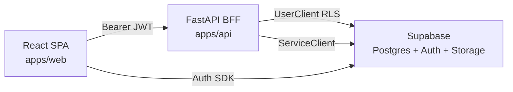

# SITE SECURE — Master Project Baseline

**Document role:** Single authoritative product + technical status baseline  
**Mode:** Discovery / audit / documentation only  
**Generated:** 2026-09-24  
**Evidence rule:** Current repository code wins over Docs when they disagree  
**Deployment note:** Controlled deploy 2026-09-24 applied `0052`→`0056` on SiteSecureV1 (`rhxqqudlngimhplvndmz`). Evidence: `Docs/SUPABASE-MIGRATION-DEPLOYMENT-2026-09-24.md`.  

**Related historical docs remain valuable as implementation reports.** This file is the **MASTER BASELINE**.

---

## Status taxonomy (used everywhere)

| Status | Meaning |
|--------|---------|
| **COMPLETE** | Wired end-to-end (UI → API → DB/authz) for stated scope |
| **PARTIAL** | Real layers exist; depth, journey, or secondary surfaces incomplete |
| **UI-ONLY** | UI exists without authoritative backend behavior |
| **BACKEND-ONLY** | Schema/API without meaningful product UI |
| **SCAFFOLDED** | Types/enums/routes exist; not a usable product flow |
| **LEGACY** | Kept for compatibility; superseded by newer path |
| **DEAD / ORPHANED** | Unreachable or unused in current product surface |
| **BLOCKED** | Cannot be production-verified or used in current env |
| **DEFERRED** | Explicitly out of current product scope |
| **NOT STARTED** | No meaningful implementation |
| **NEEDS VERIFICATION** | Code exists; live/production proof missing or incomplete |

Also always distinguish:

- **CODE COMPLETE** — implemented and tested in repo  
- **PRODUCTION VERIFIED** — confirmed against the live Supabase/API environment  

---

## Master status table (major areas)

| Area | Overall | Code | Prod verified | Notes |
|------|---------|------|---------------|-------|
| Public Website | COMPLETE | Yes | NEEDS VERIFICATION | Single landing + legal; fixed brand-dark |
| Authentication | COMPLETE | Yes | NEEDS VERIFICATION | Supabase Auth + session hydrate |
| AppShell / Nav | COMPLETE | Yes | NEEDS VERIFICATION | Desktop sidebar + mobile bottom spine |
| Dashboard | PARTIAL | Yes | PARTIAL | Live data; assignment schema unblocked (0052) |
| Customers | COMPLETE | Yes | NEEDS VERIFICATION | List + 360 profile |
| Sites / Site dossier | PARTIAL | Yes | NEEDS VERIFICATION | Strong dossier; soft delete UI gap |
| Service calls | PARTIAL | Yes | PARTIAL | List/create/job; `number` live (0053) |
| Warranties / Knowledge | PARTIAL | Yes | NEEDS VERIFICATION | Thin CRUD |
| Tasks (“calendar”) | PARTIAL | Yes | NEEDS VERIFICATION | List/create/done — not a real calendar |
| Field Operations / Jobs | PARTIAL | Yes | PARTIAL | Lifecycle solid; `unassigned_at` deployed (0052) |
| Projects | PARTIAL | Yes | NEEDS VERIFICATION | From-quote rules solid; detail thin |
| Leads | PARTIAL | Yes | NEEDS VERIFICATION | CRM funnel |
| Catalog | COMPLETE | Yes | NEEDS VERIFICATION | Products + import + cost gate |
| Quote templates | COMPLETE | Yes | NEEDS VERIFICATION | Apply/save via Quote CPQ |
| Quote packages | COMPLETE | Yes | NEEDS VERIFICATION | Apply/save via Quote CPQ |
| Quotes (list/lifecycle) | COMPLETE | Yes | NEEDS VERIFICATION | Full status set |
| Quote Builder Stage 1 | COMPLETE | Yes | NEEDS VERIFICATION | Context / customer / site optional |
| Quote Builder Stage 2 | COMPLETE | Yes | NEEDS VERIFICATION | Solution workspace (structural separation) |
| Quote Builder Stage 3 | COMPLETE | Yes | NEEDS VERIFICATION | Commercial workspace + server totals |
| Quote Builder Stage 4 | COMPLETE | Yes | NEEDS VERIFICATION | Terms + one Send |
| Pricing | COMPLETE | Yes | NEEDS VERIFICATION | Server-authoritative `pricing.py` |
| Share | COMPLETE | Yes | NEEDS VERIFICATION | View link; no status change |
| Preview | COMPLETE | Yes | NEEDS VERIFICATION | Staff-only |
| Send | COMPLETE | Yes | NEEDS VERIFICATION | Formal draft→sent + snapshot |
| Public Approval | COMPLETE | Yes | NEEDS VERIFICATION | Customer approve/reject |
| PDF | COMPLETE | Yes | NEEDS VERIFICATION | Snapshot for post-send states (A3) |
| Quote Versioning / Revise | COMPLETE | Yes | NEEDS VERIFICATION | Same quote_id; version bump |
| System Builder platform | PARTIAL | Yes | — | CCTV only; other engines stubs |
| CCTV Engine | COMPLETE | Yes | NEEDS VERIFICATION | Recommend + sizing authoritative on API |
| Durable System Design R1 | **COMPLETE** | Yes | **PRODUCTION VERIFIED** | Live API CRUD/CAS on 2026-09-24 deploy |
| Durable Hydration R2 | **COMPLETE** | Yes | **PRODUCTION VERIFIED** | API persistence path verified; UI reopen not browser-automated |
| Atomic Apply R3 | **COMPLETE** | Yes | **PRODUCTION VERIFIED** | RPC ownership/fingerprint/re-Apply/diverge verified |
| Equipment Intent E1 | COMPLETE | Yes | NEEDS VERIFICATION | UX resolution states |
| Equipment Intent E2 | **COMPLETE** | Yes | **PRODUCTION VERIFIED** | Live intent persist/reload; commercial keys rejected |
| Equipment Intent E3 | **NOT STARTED** | — | — | Non-catalog Apply not implemented |
| Company Settings | COMPLETE | Yes | NEEDS VERIFICATION | Incl. payment details card |
| Profile / Avatar | PARTIAL | Yes | — | Theme OK; avatar static asset |
| Mobile Quote architecture | COMPLETE | Yes | NEEDS VERIFICATION | Protected dock stack |
| Accessibility | PARTIAL | — | NEEDS VERIFICATION | Labels/ARIA present; no WCAG claim |
| Production DB verification | PARTIAL | — | Yes (0052–0056) | See §46–47 + deploy report |

---

# SECTION 1 — Executive product summary

**SITE SECURE** is a Hebrew-first, RTL, multi-tenant SaaS “operating system” for Israeli security / low-voltage / field-service companies (CCTV, alarm, access, installation, service).

**Who it is for:** Workspace owners, administrators, managers, sales, and technicians in the same tenant.

**Core business workflow supported today:**

Customer / Lead → (optional Site) → Quote (CPQ + optional CCTV System Design) → Share/Send → Customer Approve/Reject → Project → Field Job → (thin) Service / Warranty

**Maturity:** Commercial Quote/CPQ path is the strongest, deepest product loop. Field/ops modules exist but are thinner. Future domains (patrol, maps, Stripe billing, native offline mobile) are deferred / not built.

**Strongest flow:** Draft Quote → Guided Builder Stages 1–4 → Preview/Share/Send → Public portal approve → Project-from-quote (when Site present).

**Major incomplete areas:** Non-CCTV System Builder engines; Equipment Intent Apply (E3); field dispatch depth; service contracts UI; multi-workspace switcher.

**Infrastructure (2026-09-24):** Migrations `0052`–`0056` deployed and checkpoint-verified on SiteSecureV1. E3 remains NOT STARTED.

---

# SECTION 2 — Product thesis

Verified against app copy, routes, and authz catalog:

SITE SECURE is a **Hebrew-first, RTL, multi-tenant SaaS** for security / low-voltage companies. Theme: public/auth fixed brand-dark; `/app` supports Light/Dark/System.

### Conceptual journey vs reality

| Step | Status |
|------|--------|
| Customer | COMPLETE |
| Site | PARTIAL (optional on Quote send; required for project-from-quote) |
| Need / Lead | PARTIAL |
| System Design (CCTV) | COMPLETE; PRODUCTION VERIFIED (R1/R2/R3/E2 on 2026-09-24) |
| Quote | COMPLETE (guided Stages 1–4) |
| Customer Decision | COMPLETE (public approve/reject) |
| Project | PARTIAL |
| Field Work | PARTIAL (assignment schema unblocked 0052) |
| Procurement / commissioning / warranty ops | DEFERRED / thin warranties only |

Do not present Alarm/Access/Intercom engineering, procurement, inventory, Stripe payments, or AI-authoritative engineering as current functionality.

---

# SECTION 3 — Technical architecture

| Layer | Stack | Evidence |
|-------|-------|----------|
| Frontend | React + Vite + TanStack Router + TanStack Query | `apps/web` |
| BFF | FastAPI | `apps/api/app/main.py` (SITE SECURE V2 API) |
| DB / Auth / Storage | Supabase (Postgres, Auth, Storage) | env + migrations |
| AuthZ catalog | Shared JSON | `packages/authz/catalog.json` |
| UI kit | `@site-secure/ui` + design tokens | `packages/ui`, `packages/design-system` |
| API client | `@site-secure/api-client` | `packages/api-client` |
| Pricing | Python server | `apps/api/app/pricing.py` |
| CCTV | Python sizing + recommend | `apps/api/app/cctv_sizing`, `cctv_recommend` |
| PDF | Server render | `apps/api/app/quote_pdf.py` |
| Excel/import | Catalog import | `apps/api/app/catalog_import` |
| Tests | Vitest (web) + Pytest (api) | `apps/web/tests`, `apps/api/tests` |

**Auth pattern:** No global JWT middleware. Routes use `Depends` → Bearer → `UserClient` (RLS) + `authorize()`/`require()`. Service role used after authz for public tokens / privileged writes.

---

# SECTION 4 — Repository map

| Path | Owns |
|------|------|
| `apps/web` | SPA, Quote Builder, dashboards, field UI, public site |
| `apps/api` | FastAPI BFF, pricing, CCTV, authz engine, PDF, System Designs |
| `packages/ui` | Shared React primitives |
| `packages/design-system` | Tokens |
| `packages/api-client` | Typed HTTP client |
| `packages/authz` | Permission/role/plan catalog |
| `packages/types` | Shared TS types |
| `supabase/migrations` | Schema, RLS, RPCs (66 files) |
| `Docs/` | Implementation reports + this baseline |
| `scripts/` / `apps/web/scripts` | QA / tooling |

---

# SECTION 5 — Route / screen inventory

Router: TanStack file routes (`apps/web/src/routes/**`, `routeTree.gen.ts`).

### Public / auth

| Route | Purpose | Status |
|-------|---------|--------|
| `/` | Marketing home | COMPLETE |
| `/legal/$slug` | Legal docs | COMPLETE |
| `/login` `/register` `/forgot-password` `/reset-password` `/verify-email` | Auth | COMPLETE |
| `/invite/$token` | Accept invite | COMPLETE |
| `/onboarding` | Create workspace | COMPLETE |
| `/q/$token` | Redirect → public quote | COMPLETE |
| `/public/quotes/$token` | Customer portal | COMPLETE |

### App (`/app/*` protected)

| Route | Purpose | Nav | Status |
|-------|---------|-----|--------|
| `/app/dashboard` | Ops command center | Yes | PARTIAL |
| `/app/today` | Technician day board | Yes | PARTIAL / BLOCKED risk |
| `/app/tasks` | Tasks list | Yes | PARTIAL |
| `/app/customers` (+ `$id`) | CRM | Yes | COMPLETE |
| `/app/leads` (+ `$id`) | Leads | Yes | PARTIAL |
| `/app/quotes` / `new` / `$id` / `preview` | Quotes | Yes | COMPLETE |
| `/app/catalog` | Catalog | Yes | COMPLETE |
| `/app/projects` (+ `$id`) | Projects | Yes | PARTIAL |
| `/app/sites` (+ `$id`) | Sites / dossier | Yes | PARTIAL |
| `/app/service` | Service calls | Yes | PARTIAL |
| `/app/warranties` | Warranties | Yes | PARTIAL |
| `/app/knowledge` | Knowledge | Yes | PARTIAL |
| `/app/jobs/$jobId` | Field job | Deep link only | PARTIAL |
| `/app/settings/*` | Settings hub | Settings shell | PARTIAL–COMPLETE |

### Admin / dev

| Route | Status |
|-------|--------|
| `/admin/*` | COMPLETE for platform admin |
| `/dev/ui` | UI-ONLY / DEV orphan |

---

# SECTION 6 — Navigation / App Shell

| Surface | Evidence | Notes |
|---------|----------|-------|
| Desktop sidebar | `AppSidebar.tsx`, `lib/app-nav.ts` | Permission + feature gated |
| Mobile bottom | `AppBottomNav.tsx` | Home / Customers / Work / Tasks / More |
| Topbar | `AppShell.tsx` | Search → CommandPalette; system status; account |
| Account | `UserAccountMenu.tsx` | Settings, admin, sign-out |
| Feedback FAB | `FeedbackCenter.tsx` | Present |
| Theme | `lib/theme.ts` | Public/auth **fixed brand-dark**; `/app` Light/Dark/System |

**Inconsistency:** No multi-workspace switcher — always `memberships[0]`.

---

# SECTION 7 — Authentication

| Capability | Status | Evidence |
|------------|--------|----------|
| Sign in / out | COMPLETE | Supabase Auth + `session.tsx` |
| Session hydrate | COMPLETE | `GET /api/v1/auth/session` |
| Protected `/app` | COMPLETE | `routes/app/route.tsx` |
| Workspace create | COMPLETE | `/onboarding` |
| Invite accept | COMPLETE | `/invite/$token` |
| Password reset | COMPLETE | forgot/reset routes |
| Workspace switcher | NOT STARTED | First membership only |

---

# SECTION 8 — Multi-tenancy / workspaces

| Concern | Reality |
|---------|---------|
| Tenant key | `workspace_id` on nearly all tables |
| Propagation | URL/session workspace → API path `/workspaces/{id}/…` |
| RLS | `auth_is_member` / managerial / assigned-scope helpers (`0007_auth_helpers.sql`) |
| Server authz | `authorize()` / `require()` after membership load |
| UI permissions | `can()` presentation only |

**Rule (verified):** `authorize()` is authoritative; `can()` is UX hiding — not security.

---

# SECTION 9 — Authorization / roles

**Roles:** owner, administrator, manager, sales, technician (assigned scope), viewer — `packages/authz/catalog.json`.

| Area | Enforcement |
|------|-------------|
| Feature + grant + scope + resource state | Server `authz/engine.py` |
| Technician commercial deny | Catalog + `workspace_rbac.py` + migration `0047` |
| Cost visibility | `quotes.view_cost` strips cost/margin |
| Quote edit/send | Draft-only resource states |

Known exception class: UI may hide controls that server would also deny — correct pattern when both present.

---

# SECTION 10 — Dashboard

**Composition:** `OpsDashboard` — command hero, attention, today/active work, recent quotes (`apps/web/src/components/dashboard/*`).

| Data | Status |
|------|--------|
| Quotes / jobs / KPIs | Real server composition (`dashboard.py`) |
| Attention (quotes + overdue jobs) | Real |
| Unassigned jobs attention | Only if `assignments_reliable` (owner/admin/manager) |
| Leads in attention | Extra client `listLeads` |
| Activity strip | Narrow synthesis — not full event stream |

**Assignment schema:** Migration `0052` **deployed 2026-09-24** on SiteSecureV1 (`unassigned_at` present; assignment row count preserved). Prior blocker (missing column → 400 filters) is **CLOSED** for this target. Technician Today UI was not browser-automated in the deploy session.

---

# SECTION 11 — Customers

| Capability | Status |
|------------|--------|
| List / search / create / edit / detail | COMPLETE |
| Contacts | COMPLETE |
| Related sites/quotes/projects | PARTIAL depth (N+1 enrichment) |
| Delete/archive | Present in profile flows |

Evidence: `routes/app/customers/*`, `routers/customers.py`, `0010_customers.sql`.

---

# SECTION 12 — Sites

| Capability | Status |
|------------|--------|
| CRUD + Site dossier | PARTIAL / strong dossier |
| Quote `site_id` | **Optional** for Send |
| Project-from-quote | **Requires** Site |
| Job `site_id` | Required |
| Delete UI | API exists; dossier delete UX gap |

---

# SECTION 13 — Service / dossiers

| Product name in code | Status |
|----------------------|--------|
| Site dossier (`/app/sites/$siteId`) | PARTIAL–COMPLETE |
| Service calls (`/app/service`) | PARTIAL |
| Warranties | PARTIAL |
| Knowledge | PARTIAL |
| `service_contracts` table | **BACKEND-ONLY** (no product UI/API surface found) |

---

# SECTION 14 — Tasks / work management

| Entity | Meaning | Status |
|--------|---------|--------|
| **Task** | Lightweight to-do (`/app/tasks`, calendar permission) | PARTIAL — not a calendar product |
| **Job** | Field work unit (`/app/jobs/$id`) | PARTIAL — no list route |
| **Project** | Delivery container | PARTIAL |

Do not conflate these three.

---

# SECTION 15 — Field Operations

**Authoritative lifecycle:** `apps/api/app/job_lifecycle.py` + `routers/jobs.py`  
**UI:** `FieldJob.tsx`, `/app/today`

Flow: scheduled → en_route → arrived → in_progress → completed (+ blocked/cancelled enum).

| Status | Detail |
|--------|--------|
| CODE | PARTIAL but real |
| PRODUCTION | **BLOCKED** on envs missing `unassigned_at` |

Protected: do not casually change job lifecycle transitions.

---

# SECTION 16 — Projects

| Capability | Status |
|------------|--------|
| List / create | PARTIAL |
| From approved Quote | COMPLETE rules (`project_from_quote.py`) — needs customer + site |
| Start installation job | PARTIAL |
| Full project FSM UI | NOT STARTED / thin |

---

# SECTION 17 — Quotes overview

**DB statuses:** `draft | sent | viewed | approved | rejected | expired | cancelled` (`0016_quotes.sql`).

**`superseded`:** NOT a DB status — public overlay when token version ≠ live quote version.

| Capability | Status |
|------------|--------|
| List / new / edit draft | COMPLETE |
| Soft cancel | COMPLETE |
| Send / Share / Preview | COMPLETE (distinct) |
| Public view / approve / reject | COMPLETE |
| Revise → new draft version | COMPLETE (same `quote_id`) |
| PDF | COMPLETE (A3 snapshot for post-send) |
| Project conversion | PARTIAL (gated on site) |

---

# SECTION 18 — Quote Builder architecture

Four guided stages (`workspace/types.ts`):

1. `details` — פרטי ההצעה  
2. `items` — תכנון וציוד (planning)  
3. `pricing` — הצעה ומחיר (commercial)  
4. `review` — תנאים ושליחה  

**Keep-alive:** Stages 2+3 share mounted `QuoteLinesPanel` with `workspaceMode` — one Quote state, two presentations.

Free stage jumping preserved. Navigation does not create Quote / Apply / Send.

---

# SECTION 19 — Quote Stage 1

| Field / action | Required? | Notes |
|----------------|-----------|-------|
| Customer | Required for readiness/send completeness | Create/select/replace flows |
| Site | **Optional** for Send; recommended | Required later for project-from-quote |
| Title / validity / terms seeds | Optional / recommended | Readiness distinguishes required vs recommended |
| Templates fast-path | Optional | Apply template |
| Quote discount | **Not** Stage 1 | Moved to Stage 3 |

---

# SECTION 20 — Quote Stage 2 (Solution Workspace)

**Purpose:** Build the solution — not price it.

| Element | Status |
|---------|--------|
| `SolutionItemCard` | COMPLETE — desc/qty/SKU meta; **no** unit price / discount / line total |
| Equipment / services buckets | COMPLETE |
| `PlanningSystemDesignCard` | COMPLETE when designs listed |
| System Builder / catalog / +פריט / sections | COMPLETE |
| Catalog search | Planning only |
| Count copy | `N פריטים בפתרון` |

Ordinary catalog/manual lines do **not** invent Design/E2 state. Design-backed richness only when System Design data exists.

---

# SECTION 21 — Quote Stage 3 (Commercial Workspace)

| Element | Status |
|---------|--------|
| `QuoteLineRow` | COMPLETE commercial grid |
| Line qty / unit price / discount / total | COMPLETE |
| Section discount | COMPLETE |
| Quote discount ₪/% | COMPLETE |
| Financial summary | COMPLETE — server `subtotal_net`, VAT, `total_gross` |
| Cost/margin | Gated by `quotes.view_cost` |
| Composition launchers | Demoted — back to planning |

Client cannot dictate authoritative totals.

---

# SECTION 22 — Quote Stage 4

| Element | Status |
|---------|--------|
| Payment / warranty / general terms / notes | COMPLETE editors |
| Empty terms show **לא הוגדר** when unset | COMPLETE |
| Company-default hydration | **PARTIAL / NEEDS VERIFICATION** — do not claim auto-fill unless proven |
| Readiness required vs recommended | COMPLETE |
| Preview + **one** Send | COMPLETE |
| No generic Next | COMPLETE |
| Dock Send suppressed | COMPLETE |

---

# SECTION 23 — Quote mobile architecture

**Protected stacking:** Quote dock (`QuoteMobileActionsBar`) + AppShell bottom nav + clearance CSS vars + feedback FAB offset.

| Stage (draft) | Dock summary | Primary |
|---------------|--------------|---------|
| 1 | Identity/status | המשך לתכנון |
| 2 | תכנון · item count | המשך למחיר |
| 3 | סה״כ money | המשך לתנאים |
| 4 | Money | Send in **panel only** |

Do not casually change z-index / clearance / portal architecture.

---

# SECTION 24 — Quote composition types

| Type | Create | Edit | Price | PDF/Public | Status |
|------|--------|------|-------|------------|--------|
| catalog | Yes | Yes | Yes | Yes | COMPLETE |
| free/manual | Yes | Yes | Yes | Yes | COMPLETE |
| labor/service | Yes | Yes | Yes | Yes | COMPLETE |
| note | Yes | Yes | Excluded | As note | COMPLETE |
| section | Yes | Yes | Section discount | Grouped | COMPLETE |
| template | Apply/save | Via lines | Via lines | Via lines | COMPLETE |
| package | Apply/save | Via lines | Via lines | Via lines | COMPLETE |
| System Builder CCTV | Design→Apply | Design CAS | Via applied lines | Via lines | CODE COMPLETE; prod BLOCKED risk |
| Intent-only (no product) | Design-side | Design-side | No Apply | N/A | E3 NOT STARTED |

---

# SECTION 25 — Pricing / CPQ

**Owner:** `apps/api/app/pricing.py` — server authoritative.

Order: line net → section discounts → Quote discount → VAT → cost/margin.

`_persist_totals` on quote mutations. Client line preview is UX only.

---

# SECTION 26 — VAT

| Concern | Status |
|---------|--------|
| Quote `vat_percent` (default 18) | COMPLETE — used in `recalculate` |
| Product `vat_eligible` | **PARTIAL** — stored/snapshotted; **unused in VAT math** (`pricing.py` has no reference) |

---

# SECTION 27 — Share / Preview / Send

| Concept | Meaning | Lifecycle |
|---------|---------|-----------|
| **PREVIEW** | Staff customer-view | No status change |
| **SHARE** | Mint public view link | Does **not** set `sent` |
| **SEND** | Formal publish | draft→sent + snapshot + mint |

Evidence: `routers/quotes.py` send/share/preview; A3 outbound integrity tests.

---

# SECTION 28 — Customer approval

Public token portal: view / PDF / approve (signature) / reject.

Approve/reject only when status ∈ `{sent, viewed}` and not superseded.

**Staff approve endpoint:** not found — approval is customer-token path.

---

# SECTION 29 — Versioning / Revise

- `quotes.version` integer  
- Revise: same quote id, `version+1`, back to draft, clears send/view/approval fields  
- Prior public token becomes superseded overlay  
- Version history/compare via `quote_cpq` versions APIs  

---

# SECTION 30 — PDF

| Path | Source | Status |
|------|--------|--------|
| Staff draft PDF | Live document payload | COMPLETE |
| Staff sent/viewed/approved/rejected/expired | `quote_versions.snapshot.public` when present | COMPLETE (A3) |
| Public PDF | Snapshot; mark_viewed=false | COMPLETE |

**Doc contradiction:** older `QUOTE-BUILDER-CAPABILITY-AUDIT.md` still describes live lines for staff post-send PDF — **code wins (snapshot)**.

---

# SECTION 31 — System Builder platform

Not a separate Quote product — a composition engine into Quote.

Flow: Requirements → Engineering → Recommendation → Selection/Intent → (R3 Apply) → Quote lines.

| Engine | Status |
|--------|--------|
| CCTV | REAL |
| Alarm / Access / Intercom / others | **SCAFFOLDED / STUB** — UI forced to CCTV; API `ENGINE_TYPES={"cctv"}` |

---

# SECTION 32 — CCTV engine

| Piece | Path | Status |
|-------|------|--------|
| Recommend API | `POST /cctv/recommend` | COMPLETE |
| Sizing | `cctv_sizing/` | COMPLETE |
| Recommend assembly | `cctv_recommend/` | COMPLETE |
| Drawer UX | `SystemBuilderDrawer.tsx` | COMPLETE |
| TS sizing | `apps/web/src/lib/cctv-sizing` | Parity/tests (not production SPA import) |
| Apply | R3 only with catalog product | COMPLETE for catalog path |

Protected deterministic engineering code — do not casually change.

---

# SECTION 33 — Durable System Design (R1/R2/R3)

| Release | What | Repo status | Prod |
|---------|------|-------------|------|
| R1 | Tables + CRUD + revision CAS | COMPLETE (`0054`) | **PRODUCTION VERIFIED** (2026-09-24 live API) |
| R2 | CCTV hydrate/persist into Design | COMPLETE (app layer) | **PRODUCTION VERIFIED** (API persistence; UI reopen not browser-automated) |
| R3 | Atomic owned Apply RPC | COMPLETE (`0055` + `apply.py`) | **PRODUCTION VERIFIED** (RPC semantics 2026-09-24) |

Deploy evidence: `Docs/SUPABASE-MIGRATION-DEPLOYMENT-2026-09-24.md`. Historical probe of missing objects: `Docs/DURABLE-CCTV-PRODUCTION-VERIFICATION.md` (superseded for this target).

---

# SECTION 34 — Equipment Intent (E1/E2)

**Why:** Engineering can be complete without catalog product. Intent holds manufacturer / model_reference / display_description / selected_attributes — **not** a fake catalog row.

| Layer | Status |
|-------|--------|
| E1 UX states | COMPLETE |
| E2 jsonb persistence | COMPLETE (`0056`) |
| Prod deploy of 0056 | **PRODUCTION VERIFIED** (2026-09-24) |

Does **not** create: product_id, SKU, authoritative price, cost.

---

# SECTION 35 — E3 gap

**NOT STARTED.**

Intent-only components are skipped by `proposed_engineering_lines` (requires product_id). Apply UX blocks intent-only Apply.

Open decisions: Quote identity without product, fingerprint, divergence, pricing, atomic replace.

---

# SECTION 36 — Catalog

| Capability | Status |
|------------|--------|
| Products / categories / search / CRUD | COMPLETE |
| Import wizard | COMPLETE |
| Cost field | COMPLETE gated by `quotes.view_cost` |
| System Builder candidates | COMPLETE for CCTV matching |
| Free-text legacy matching | LEGACY / non-authoritative paths documented in System Builder |

---

# SECTION 37 — Templates / Packages

Three different “template/package” concepts:

1. **Quote templates** — line recipes (`apply-template`) — COMPLETE  
2. **Quote packages** — packaged line sets (`apply-package`) — COMPLETE  
3. **PDF templates** — branding documents in settings — separate COMPLETE surface  

Catalog category named “packages” ≠ `quote_packages`.

---

# SECTION 38 — Company settings

| Area | Status |
|------|--------|
| Workspace name / timezone / VAT | COMPLETE |
| Company profile + payment details card | COMPLETE |
| PDF templates / numbering / roles / users | PARTIAL–COMPLETE by page |
| Stage 4 company-default terms hydration | PARTIAL / NEEDS VERIFICATION |

---

# SECTION 39 — User / profile settings

| Capability | Status |
|------------|--------|
| Theme preference | COMPLETE |
| Display name via `patchMe` | PARTIAL |
| Avatar upload | **UI-ONLY / static** (`avatar-man.png` hardcoded) |

---

# SECTION 40 — Public website

Single landing (`PublicHome`) + legal routes. Fixed brand-dark. CTAs → login/register/app. Anchor sections, not multi-page marketing site. **COMPLETE** for current scope.

---

# SECTION 41 — Design system

| Asset | Notes |
|-------|-------|
| Brand fonts | Heebo (Hebrew), Inter, JetBrains Mono |
| Tokens | `packages/design-system` |
| Primitives | `packages/ui` |
| Product CSS | **`apps/web/src/styles.css` ≈ 17,625 lines** — maintainability risk |

RTL is first-class (`dir=rtl`, Hebrew copy in `i18n/he.ts`).

---

# SECTION 42 — Responsive / mobile maturity

| Area | Maturity |
|------|----------|
| Quote Builder + dock | good (heavily tested) |
| Dashboard | good–partial |
| Field Today / FieldJob | partial |
| CRM lists | partial / desktop-first remnants |
| Settings | partial |
| Public landing | good |

---

# SECTION 43 — Accessibility

Semantic labels, ARIA on docks/menus, focus rings exist. **No formal WCAG audit in repo.** Status: **PARTIAL / NEEDS VERIFICATION**.

---

# SECTION 44 — Test inventory (by domain)

| Domain | Coverage | Gaps |
|--------|----------|------|
| Quote Builder / guided / structural stages | Strong vitest | Live E2E sparse |
| Pricing | Strong pytest | — |
| Share/Send/A3/PDF/public | Strong pytest | — |
| CCTV sizing parity / recommend | Strong | — |
| System Design R1/R3 | Strong unit + live deploy verify | — |
| E1/E2 | Strong unit + live E2 verify | E3 absent |
| Dashboard / attention | Moderate | — |
| Field lifecycle | Moderate | — |
| Customers / sites | Moderate | — |
| Accessibility | Weak | — |

---

# SECTION 45 — Database / migrations (critical)

| Migration | Concern | In repo | Live verified (SiteSecureV1 2026-09-24) |
|-----------|---------|---------|---------------|
| `0052_assignment_history.sql` | `unassigned_at` | Yes | **YES** |
| `0053_service_call_numbers.sql` | `service_calls.number` | Yes | **YES** |
| `0054_system_designs.sql` | R1 tables | Yes | **YES** |
| `0055_system_design_apply_owned.sql` | R3 RPC | Yes | **YES** |
| `0056_system_design_equipment_intent.sql` | E2 column | Yes | **YES** |
| `0016_quotes.sql` + CPQ migrations | Quotes/versions/snapshot | Yes | Yes (quotes exist on probed env) |
| `0047` technician commercial | Authz | Yes | NEEDS VERIFICATION |

66 migrations total in repo.

---

# SECTION 46 — Production verification

| Claim | Result |
|-------|--------|
| Quotes / commercial tables live | Confirmed |
| `system_designs` / components / Apply RPC / `equipment_intent` | **Present on SiteSecureV1 after 2026-09-24 deploy** |
| Automated suites | Pass (see deploy report for exact suite counts) |
| Classification for Design vertical | **COMPLETE · PRODUCTION VERIFIED (R1/R2/R3/E2)** — E3 NOT STARTED |

Deploy report: `Docs/SUPABASE-MIGRATION-DEPLOYMENT-2026-09-24.md`.

---

# SECTION 47 — Known blockers

| ID | Area | Problem | Impact | Code | Env | Need | Priority |
|----|------|---------|--------|------|-----|------|----------|
| B1 | System Design | ~~0054/0055 undeployed~~ | — | COMPLETE | **CLOSED 2026-09-24** | — | — |
| B2 | Equipment Intent | ~~0056 undeployed~~ | — | COMPLETE | **CLOSED 2026-09-24** | — | — |
| B3 | Field / Dashboard | ~~`unassigned_at` missing~~ | — | COMPLETE | **CLOSED 2026-09-24** | Optional browser Today proof | — |
| B4 | E3 | No non-catalog Apply | Intent cannot become Design-owned Quote money | NOT STARTED | N/A | Product decisions | **P0/P1** |
| B5 | Multi-workspace | No switcher | Wrong workspace if multi-membership | NOT STARTED | N/A | Product decision | P2 |

---

# SECTION 48 — Partial implementations matrix

| Feature | UI | FE logic | API | DB | Authz | PDF/Public | Tests | Status | Missing |
|---------|----|----------|-----|----|-------|------------|-------|--------|---------|
| Intent-only Apply | Blocks | Yes | Skips | Intent col | — | — | E1/E2 only | NOT STARTED E3 | Apply semantics |
| `vat_eligible` | Catalog field | — | Stored | Column | — | Snapshot only | — | PARTIAL | Pricing use |
| `service_contracts` | No | No | No | Table | RLS? | — | — | BACKEND-ONLY | Entire product |
| Non-CCTV engines | Disabled | Types | Rejected | CHECK cctv | — | — | — | SCAFFOLDED | Engines |
| Avatar | Static image | — | patchMe no photo | — | — | — | — | UI-ONLY | Upload |
| Tasks “calendar” | List | Done toggle | CRUD | Table | calendar.* | — | Thin | PARTIAL | Calendar UI |
| Jobs list | No | Detail only | Jobs API | Table | jobs.* | — | Lifecycle | PARTIAL | List route |
| Stage 4 company defaults | Shows unset | — | Settings exist | — | — | — | — | PARTIAL | Hydration proof |
| Staff post-send PDF docs | — | — | Snapshot | Versions | — | Snapshot | A3 | Docs LAG | Doc update |

---

# SECTION 49 — Dead / legacy / orphaned

| Item | Classification | Evidence |
|------|----------------|----------|
| `/dev/ui` | ORPHANED (dev) | Route redirects in prod |
| Legacy System Builder keyword recommend | LEGACY | `system-builder.ts` header |
| Legacy sequential addQuoteItem apply path | LEGACY / fallback | Drawer comments |
| `LeadsAttention` preferred deprecated | LIKELY LEGACY | Comment → unified attention |
| `service_contracts` unused | DEAD product surface | Table only |
| Founding technician role | LEGACY retired | Migrations + tests |
| `ActivityList` unused component | NEEDS INVESTIGATION | Dashboard uses other activity |
| Doc claims of live post-send PDF from lines | SUPERSEDED | Code uses snapshot |

**No deletions performed.**

---

# SECTION 50 — Fallbacks / compatibility

| Fallback | Why | Risk if removed |
|----------|-----|-----------------|
| Legacy job start from en_route | Older clients | Break field flows |
| Legacy quote sent snapshot company freeze paths | Historical sends | PDF/company drift |
| Catalog attr unknown key preserve | Forward compat | Data loss |
| System Builder legacy add lines | Pre-R3 | Only if R3 unavailable — keep until Design migrations universal |
| Address legacy aliases | Company profile | Broken branding |

---

# SECTION 51 — Technical debt / risk map

| Area | Risk | Why | Mitigation | Safe future action |
|------|------|-----|------------|--------------------|
| `QuoteBuilder.tsx` size | High | Hub of commercial UX | Tests + stage panels | Incremental extraction |
| `styles.css` ~17.6k lines | High | Merge conflicts | Tokens + ui package | Modularize later |
| Pricing ownership | Critical | Money | Server only | Never client totals |
| PDF snapshot immutability | Critical | Legal artifact | A3 snapshot states | Preserve |
| RLS/workspace isolation | Critical | Multi-tenant | Helpers + FORCE RLS | Audit on deploy |
| System Design migrations | Critical | Feature dead live | Docs gate | Deploy then verify |
| Dirty state Stage 2↔3 | Medium | Lost edits | Flush on unmount | Keep shared panel |
| CCTV TS/Python parity | Medium | Drift | Parity tests | Keep tests green |
| Assignment schema drift | High | Field broken | Migration 0052 | Deploy |

---

# SECTION 52 — Protected systems (do not casually change)

| System | Paths | Why |
|--------|-------|-----|
| Pricing | `apps/api/app/pricing.py` | Money truth |
| Quote lifecycle Send/Share | `routers/quotes.py` | Legal/commercial |
| Public decide | `routers/public_quotes.py` | Customer commitment |
| Snapshot | `quote_snapshot.py` | Immutability |
| PDF | `quote_pdf.py` | Output fidelity |
| CCTV sizing/recommend | `cctv_sizing/`, `cctv_recommend/` | Engineering determinism |
| R3 Apply | `system_designs/apply.py`, `0055_*.sql` | Ownership/fingerprint |
| Authz engine | `authz/engine.py`, `catalog.json` | Security |
| Job lifecycle | `job_lifecycle.py` | Field integrity |
| Quote mobile dock stack | `QuoteMobileActionsBar`, AppShell clearance CSS | Proven mobile architecture |
| API contracts | `packages/api-client` | Cross-app stability |

---

# SECTION 53 — Product capability matrix (condensed)

See Master Status Table at top. Additional rows:

| Capability | User visible | UI | Backend | DB | Perms | Tests | Prod | Overall |
|------------|--------------|----|---------|----|-------|-------|------|---------|
| Invite members | Yes | COMPLETE | COMPLETE | Yes | Yes | Present | NEEDS VERIFICATION | COMPLETE |
| Platform admin | Yes | COMPLETE | COMPLETE | Yes | platform admin | Present | NEEDS VERIFICATION | COMPLETE |
| Feedback | Yes | COMPLETE | COMPLETE | Yes | — | Thin | NEEDS VERIFICATION | COMPLETE |
| Notifications bell | No | — | — | Tables partial | — | — | — | DEFERRED |
| Stripe billing | No | — | Plans/quotas only | — | — | — | — | DEFERRED |
| Maps / patrol | No | — | — | — | keys only | — | — | DEFERRED |

---

# SECTION 54 — User journeys

| Journey | Status | Break point |
|---------|--------|-------------|
| A. New customer → Quote → Send → Approve → Project | **PARTIAL** | Project needs Site; Design optional |
| B. Existing customer → Site → Quote | **WORKS** | — |
| C. CCTV → Design → Catalog → Apply → Quote | **CODE WORKS / LIVE BLOCKED** | Migrations 0054/0055 |
| D. Manual Quote without System Builder | **WORKS** | — |
| E. Technician FieldJob | **PARTIAL / BLOCKED** | `unassigned_at` on some envs |

---

# SECTION 55 — What the product does not do yet

| Capability | Classification |
|------------|----------------|
| Non-catalog Equipment Intent Apply (E3) | NOT STARTED |
| Alarm / Access / Intercom engineering engines | SCAFFOLDED / DEFERRED |
| Procurement / PO / inventory | NOT STARTED |
| Change orders / commissioning | NOT STARTED |
| Warranty operations depth | PARTIAL list only |
| Recurring revenue / customer add-on proposals | NOT STARTED |
| Payments / Stripe / accounting sync | DEFERRED |
| AI-authoritative engineering | NOT STARTED |
| Native mobile / full offline | NOT STARTED |
| Multi-workspace switcher | NOT STARTED |
| True calendar UI | NOT STARTED |

---

# SECTION 56 — Documentation consistency

| Doc | Role now |
|-----|----------|
| **`Docs/SITE-SECURE-MASTER-PROJECT-BASELINE.md` (this file)** | **MASTER BASELINE** |
| `PRODUCT_STATUS_UNIFIED.md` | Historical inventory (2026-09-13) — useful but older; lacks Guided Stages / E1–E2 / structural separation |
| `DURABLE-CCTV-PRODUCTION-VERIFICATION.md` | Authoritative on Design deploy blocker |
| `DURABLE-SYSTEM-DESIGN-R1/R2/R3*.md` | Implementation reports — current for code |
| `EQUIPMENT-INTENT-E1/E2*.md` | Implementation reports |
| `QUOTE-BUILDER-STRUCTURAL-STAGE-SEPARATION.md` | Current Stage 2/3 presentation |
| `QUOTE-BUILDER-GUIDED-WORKSPACE-V1.md` | Guided stages |
| `QUOTE-BUILDER-CAPABILITY-AUDIT.md` | **Partially contradicted** (PDF snapshot vs live lines) |
| `QUOTE-BUILDER-UNIFIED-INTERACTION-ARCHITECTURE.md` | Mixed: early gaps vs later A3 appendix |
| Phase 1/2/3 reports | Historical |
| Beta / gate / DR docs | Ops history |

---

# SECTION 57 — Current state summary (5-minute read)

### Solid today
Auth, AppShell, Customers, Catalog, Quote list/builder Stages 1–4, server pricing, Preview/Share/Send, public approve/reject, PDF/snapshot (A3), Revise/versioning, CCTV recommend (API), company settings, Hebrew RTL.

### Functional but partial
Dashboard, Sites dossier, Projects, Field jobs, Tasks, Service/Warranties/Knowledge, Leads, profile avatar, Stage 4 company-default hydration, `vat_eligible`.

### Production verified (2026-09-24 SiteSecureV1)
System Design R1–R3, Equipment Intent E2, assignment history (`0052`), service call numbers (`0053`).

### Deferred / not started
E3, non-CCTV engines, Stripe, maps/patrol, procurement, multi-workspace switcher, native mobile.

### Do not touch casually
Pricing, Quote lifecycle, PDF/snapshot, CCTV math, R3 Apply, authz/RLS, job lifecycle, Quote mobile dock architecture.

---

# SECTION 58 — Recommended next decision points

| # | Decision | Why | Dependencies | Before implementation |
|---|----------|-----|--------------|----------------------|
| 1 | ~~Deploy & verify migrations 0052 → 0056~~ | **DONE 2026-09-24** | — | See deploy report |
| 2 | **E3 product rules** for Intent-only Apply | Closes CCTV commercial gap | R1–R3 live | Identity, fingerprint, pricing, divergence decisions |
| 3 | **Site requirement policy** for Project vs Send (confirm OK) | Journey A friction | Product | Keep optional Send / required Project unless changing thesis |
| 4 | **Field ops depth** (jobs list, block/pause) vs commercial polish | Resource allocation | Assignment schema live | Prioritize after B3 |
| 5 | **Doc baseline adoption** — treat this file as master; mark contradictory PDF notes superseded | Planning hygiene | None | Editorial only |

E3 remains the logical next **System Design capability** after production Design migrations are verified — not before.

---

## Audit method executed

1. Repository structure  
2. Routes/screens  
3. Frontend capabilities  
4. API routers/services  
5. Migrations/RLS  
6. Authz  
7. Tests  
8. Docs  
9. Cross-layer matrices  
10. Contradictions/gaps  

No product, API, migration, pricing, authz, RLS, Quote lifecycle, System Design, PDF, or UI behavior was changed while producing this document.

---

## Appendix — Key evidence paths (quick index)

- Quote Builder: `apps/web/src/components/quotes/QuoteBuilder.tsx`  
- Stage panels: `cpq/QuoteLinesPanel.tsx`, `SolutionItemCard.tsx`, `QuoteLineRow.tsx`  
- Pricing: `apps/api/app/pricing.py`  
- Designs: `apps/api/app/routers/system_designs.py`, `system_designs/apply.py`  
- Authz: `apps/api/app/authz/engine.py`, `packages/authz/catalog.json`  
- UI can(): `apps/web/src/lib/can.ts`  
- Migrations: `supabase/migrations/0052*.sql`, `0054*.sql`, `0055*.sql`, `0056*.sql`  
- Prod Design gate: `Docs/DURABLE-CCTV-PRODUCTION-VERIFICATION.md`  
