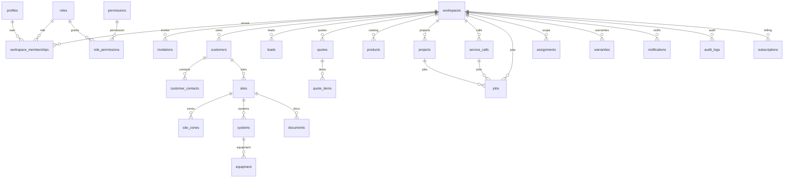

# V2 Database Design

**Status:** Binding schema design for SITE SECURE V2  
**Implements:** [V2-ARCHITECTURE.md](../architecture/V2-ARCHITECTURE.md)  
**RLS:** [V2-RLS.md](../security/V2-RLS.md)  
**Project:** new Supabase project. V1 schema is not a source.

Conventions:

- UUID primary keys (`gen_random_uuid()`)
- `timestamptz` for all timestamps
- `workspace_id uuid not null` on every tenant-owned table
- `created_at`, `updated_at`; `created_by` where an actor exists
- Soft delete (`deleted_at`) only where history matters (customers, quotes, sites)
- Unique business codes are per-workspace
- Enums for closed status machines; tables for extensible catalogs (roles, permissions, features, plans)

---

## 1. ERD (core)



---

## 2. Identity and tenancy

### `profiles`

One row per `auth.users` id. Created by trigger on signup.

| Column | Type | Notes |
|--------|------|-------|
| id | uuid PK | = `auth.users.id` |
| full_name | text | |
| phone | text | |
| locale | text | default `he` |
| avatar_path | text | storage path, not public URL |
| last_workspace_id | uuid | preference only |
| created_at / updated_at | timestamptz | |

No platform role on this table. SITE SECURE tenant roles live on memberships.

### `workspaces`

| Column | Type | Notes |
|--------|------|-------|
| id | uuid PK | |
| name | text not null | legal/display name |
| slug | text unique | optional public slug |
| status | enum `workspace_status` | `active`, `suspended`, `pending_deletion` |
| plan_id | uuid | FK plans |
| timezone | text | default `Asia/Jerusalem` |
| country_code | text | default `IL` |
| vat_percent | numeric | default 18 — editable default, not a law engine |
| created_at / updated_at | timestamptz | |

There is **no** `owner_id`. Ownership is membership with role `owner`.

### `workspace_memberships`

| Column | Type | Notes |
|--------|------|-------|
| id | uuid PK | |
| workspace_id | uuid not null | |
| user_id | uuid not null | |
| role_key | text not null | FK logical to `roles.key` |
| status | enum `membership_status` | `active`, `disabled`, `invited` (invited is on invitations; membership is created on accept) |
| technician_code | text | unique per workspace when set (`SS-FT-001`) |
| program_type | text | `founding_technician` or null |
| program_started_at / program_ends_at | timestamptz | informational; expiry does **not** auto-disable |
| created_at / updated_at | timestamptz | |

Unique `(workspace_id, user_id)`.

### `invitations`

| Column | Type | Notes |
|--------|------|-------|
| id | uuid PK | |
| workspace_id | uuid not null | |
| email | citext not null | |
| role_key | text not null | |
| token_hash | text not null | store hash, not raw token |
| invited_by | uuid | |
| expires_at | timestamptz | default now() + 14 days |
| accepted_at | timestamptz | |
| created_at | timestamptz | |

---

## 3. RBAC catalog (data)

### `roles`

`key` text PK-like unique: `owner`, `administrator`, `manager`, `sales`, `technician`, `founding_technician`, `viewer`.  
`label_he`, `label_en`, `default_scope`, `is_system` (system roles are not deletable).

### `permissions`

`key` text unique (`quotes.send`, `jobs.complete`, …).  
`group_key`, `description`.

### `role_permissions`

`(role_key, permission_key)` unique.

### `features`

`key` unique: `core`, `crm`, `sales`, `catalog`, `quotes`, `projects`, `service`, `inventory`, `finance`, `reports`, `automation`, `team`, `audit`, `api`, `ai`, `branches`, `settings`.

### `plans`

`key` unique: `solo`, `business`, `enterprise`.  
Marketing price fields nullable; source of truth for entitlements is `plan_features` + `plan_limits`.

### `plan_features` / `plan_limits`

Plan → feature keys; plan → limit keys (`seats`, `sites`, `storage_gb`).

### `subscriptions`

Workspace subscription: `plan_id`, `status` (`trialing`, `active`, `past_due`, `canceled`), `current_period_end`, external `provider_ref` (Stripe later).

Effective features = plan features unless a `workspace_feature_overrides` row exists (enterprise exceptions). Overrides are audited.

---

## 4. Assignments (scope)

One table, not V1’s split site/job tables.

### `assignments`

| Column | Type |
|--------|------|
| id | uuid |
| workspace_id | uuid not null |
| user_id | uuid not null |
| resource_type | enum `assignment_resource_type` (`site`, `job`, `project`, `service_call`, `customer`) |
| resource_id | uuid not null |
| assigned_by | uuid |
| created_at | timestamptz |

Unique `(workspace_id, user_id, resource_type, resource_id)`.

RLS helpers resolve: technician can see a site if assigned to the site **or** to a job/project on that site (see RLS doc). Auto-assign trigger: when a technician creates a site, they receive a `site` assignment (Model A field reality).

---

## 5. CRM

### `customers`

| Column | Type | Notes |
|--------|------|-------|
| id | uuid | |
| workspace_id | uuid | |
| display_name | text not null | |
| type | enum `customer_type` | `private`, `business` |
| status | enum `customer_status` | `active`, `inactive` |
| legal_name | text | |
| tax_id | text | ח.פ / עוסק |
| email / phone | text | |
| billing_address | jsonb | structured |
| notes | text | |
| deleted_at | timestamptz | |

### `customer_contacts`

name, role_title, email, phone, is_primary, customer_id, workspace_id.

### `customer_notes` / `customer_activities`

Notes are human. Activities are system+human timeline (call, meeting, quote_sent). Do not duplicate quote/job events — those live in their own event tables and are **projected** into Customer 360.

---

## 6. Sites, systems, equipment (Site File aggregate)

### `sites`

The physical location. This **is** the Site File’s identity.

| Column | Type | Notes |
|--------|------|-------|
| id | uuid | |
| workspace_id | uuid | |
| customer_id | uuid not null | |
| code | text not null | per-workspace unique, e.g. `AS-S-00041` |
| name | text not null | |
| address | jsonb | street, city, lat, lng, notes |
| installation_status | enum | `planned`, `in_progress`, `completed`, `inactive` |
| access_notes | text | gate codes — sensitive, still RLS |
| deleted_at | timestamptz | |

### `site_zones`

name, sort_order, site_id, workspace_id.

### `systems`

First-class installed system (alarm, CCTV, access, network).

| Column | Type |
|--------|------|
| site_id | uuid |
| type | enum `system_type` (`alarm`, `cctv`, `access`, `network`, `intercom`, `other`) |
| name | text |
| status | enum `system_status` |
| manufacturer / model / panel_id | text |
| metadata | jsonb | typed per system in API, not a junk drawer in UI |

### `equipment`

Belongs to a system (preferred) or a site (if unassigned).

category enum (camera, pir, nvr, panel, reader, lock, switch, cable, sim, other), status, serial, mac, ip (text, LTR in UI), location_note, installed_at, warranty_id optional.

### `site_timeline_events`

Append-only projection: `event_type`, `title`, `body`, `actor_id`, `source_type`, `source_id`. Jobs, quotes, warranties, notes write here via API — clients do not insert freely without permission.

Site File UX sections read: site, systems, equipment, documents, photos, timeline, jobs/service, warranties, readiness, notes. No extra `site_files` table.

---

## 7. Documents, photos, signatures

### `documents`

Polymorphic metadata.

| Column | Type |
|--------|------|
| workspace_id | uuid |
| entity_type | enum (`customer`, `site`, `system`, `job`, `quote`, `project`, `warranty`) |
| entity_id | uuid |
| kind | enum (`document`, `photo`, `signature`, `pdf_export`) |
| storage_bucket | text |
| storage_path | text |
| mime_type | text |
| byte_size | int |
| checksum | text |
| captured_at | timestamptz |
| created_by | uuid |

Files are never public URLs in this table.

---

## 8. Sales and quotes

### `leads`

Funnel: `new`, `contacted`, `meeting`, `spec`, `quoted`, `follow_up`, `won`, `lost`.  
Source: `website`, `referral`, `advertising`, `phone`, `other`, `manual`.  
Optional `customer_id` / `site_id` once qualified.  
`owner_user_id` for `owned` scope.

### `product_categories` / `products`

Workspace-scoped catalog. SKU unique per workspace.  
Fields: name, sku, category_id, unit, list_price, cost (permission-gated), vat_eligible, is_labor, is_active, metadata.

### `quote_templates` / `quote_template_items`

Keys: apartment, private_house, villa, office, store, warehouse, custom.

### `quotes`

| Column | Type | Notes |
|--------|------|-------|
| number | text | per-workspace sequence |
| status | enum | `draft`, `sent`, `viewed`, `approved`, `rejected`, `expired`, `cancelled` |
| customer_id / site_id / lead_id | uuid | |
| currency | text | `ILS` |
| vat_percent | numeric | snapshot |
| discount_type / discount_value | | |
| subtotal_net / vat_amount / total_gross | numeric | **server-written** |
| cost_total / margin_amount / margin_percent | numeric | server-written; API omits for roles without cost permission |
| valid_until | date | |
| payment_terms | text | |
| customer_notes / internal_notes | text | |
| version | int | |
| deleted_at | timestamptz | |

### `quote_items`

type: `catalog`, `free`, `labor`, `note`.  
qty, unit_price, cost, discount, sort_order, product_id nullable.  
Line totals stored **and** recomputed on the server.

### `quote_events` / `quote_versions`

Append-only events (created, sent, viewed, approved, …).  
Versions store a JSON snapshot for audit/restore. Draft autosave can write versions throttled.

**Pricing rule:** clients may show live estimates; `POST/PATCH` responses and PDFs use server totals. Tampered client totals are ignored.

---

## 9. Operations

### `projects`

Commercial engagement. Status: `draft`, `planned`, `in_progress`, `on_hold`, `completed`, `cancelled`.  
Links: customer, site, source_quote_id, assigned manager.

### `service_calls`

Request for service. Status: `open`, `in_progress`, `waiting`, `closed`.  
Priority: `low`, `normal`, `high`, `critical`.  
Links: customer, site, system optional.

### `jobs`

**Field work unit.** This is what technicians open on mobile.

| Column | Type | Notes |
|--------|------|-------|
| workspace_id | uuid | |
| title | text | |
| kind | enum `job_kind` | `installation`, `service`, `maintenance`, `survey`, `other` |
| status | enum `job_status` | `scheduled`, `en_route`, `in_progress`, `completed`, `cancelled` |
| project_id | uuid | nullable |
| service_call_id | uuid | nullable |
| customer_id / site_id | uuid | denormalized for RLS/query speed, must match parent |
| scheduled_for | timestamptz | |
| started_at / completed_at | timestamptz | |
| completion_notes | text | |

Assignees are `assignments` with `resource_type = job` (and often a site assignment).

### `service_contracts`

customer/site, plan key (`basic`, `plus`, `pro`), status, period.

### `tasks`

Ops follow-ups: `follow_up`, `call`, `visit`, `review_request`, `service_followup`, `maintenance`, `other`.  
Status: `open`, `done`, `cancelled`.  
`due_at`, `assignee_id`, optional links to lead/quote/job.

### `checklist_templates` / `checklist_template_items` / `job_checklist_items`

Templates are workspace-scoped (seeded defaults). Instances freeze onto a job.

### `site_readiness`

One row per site: subsystem scores (cctv, alarm, access, network, power, recording, connectivity). Written from assessments.

### `after_action_reports`

Optional AAR on job complete — structured JSON + narrative.

---

## 10. Warranties

### `warranties`

number (per workspace), public_token (random, unique), type (`manufacturer`, `installation`, `extended`, `maintenance_contract`), status (`active`, `expiring_soon`, `expired`, `cancelled`), dates, site_id, customer_id, pdf document_id.

Public access is via tokenized API route, not a public bucket.

---

## 11. Notifications and audit

### `notifications`

recipient_user_id, workspace_id, type, title, body, entity_type, entity_id, read_at, payload jsonb.

### `notification_preferences`

per user/workspace/type: in_app, email, push booleans.

### `audit_logs`

Append-only. actor_user_id (nullable for system), workspace_id, action, entity_type, entity_id, metadata jsonb, ip, user_agent, created_at.

No update/delete from clients. RLS: team admins with `audit.view` can read their workspace.

---

## 12. Knowledge

### `knowledge_articles`

workspace-scoped SOP/KB. Categories: networking, linux, cloud, security, field_ops, sop, general.  
Not a substitute for Site File.

---

## 13. Settings

### `workspace_settings`

One row per workspace. Typed sections as jsonb with Pydantic/Zod schemas:

`branding`, `quotes`, `taxes`, `scheduling`, `notifications`, `localization`.

Do not add 40 columns of unused settings. Do not ship UI for keys that are not read.

---

## 14. Inventory and finance (designed, later migrations)

**Phase 11**

- `warehouses` (workspace, name, is_default)
- `stock_levels` (warehouse, product, qty)
- `stock_movements` (type in/out/adjust/job_consume, qty, job_id nullable, idempotency_key)

**Phase 14**

- `invoices` / `invoice_items` / `payments`  
  Quotes remain the commercial offer; invoices are issued documents. Do not fake an invoice module in nav before this phase.

---

## 15. Sequences and codes

| Code | Allocator |
|------|-----------|
| Site `AS-S-#####` | `workspace_counters` table + `next_code(workspace, 'site')` |
| Quote number | same |
| Job number | same |
| Warranty number | same |
| FT technician code | `next_code(workspace, 'ft')` → `SS-FT-###` |

`workspace_counters (workspace_id, kind, last_value)` with row lock in a SQL function. Never generate codes in the client.

---

## 16. Indexes (minimum)

- All FKs
- `(workspace_id, created_at desc)` on list tables
- `(workspace_id, status)` on jobs, quotes, service_calls, projects
- `(workspace_id, scheduled_for)` on jobs
- `(workspace_id, customer_id)` on sites, quotes, jobs
- `(user_id, resource_type, resource_id)` on assignments
- Unique `(workspace_id, code)` on sites; `(workspace_id, number)` on quotes/jobs/warranties
- `documents (workspace_id, entity_type, entity_id)`

---

## 17. Constraints and integrity

- Membership role_key must exist in `roles`
- Job `site_id` must belong to the same workspace and customer
- Quote items cannot reference products from another workspace (trigger or composite FK)
- Cannot delete workspace with active memberships without an explicit admin flow
- One active owner minimum (trigger): last owner cannot be demoted/removed
- Solo seat limit enforced in API **and** in `enforce_solo_member_limit` trigger (same rule, two layers)

---

## 18. Migration map

Ordered, deterministic files under `supabase/migrations/`:

| File | Purpose |
|------|---------|
| `0001_extensions.sql` | pgcrypto, citext |
| `0002_updated_at.sql` | trigger function |
| `0003_profiles.sql` | profiles + signup trigger |
| `0004_workspaces.sql` | workspaces, counters, settings |
| `0005_rbac.sql` | roles, permissions, role_permissions |
| `0006_memberships.sql` | memberships, invitations |
| `0007_auth_helpers.sql` | RLS helper functions |
| `0008_features_plans.sql` | features, plans, subscriptions |
| `0009_assignments.sql` | assignments |
| `0010_customers.sql` | CRM |
| `0011_sites.sql` | sites, zones, timeline |
| `0012_systems.sql` | systems, equipment |
| `0013_documents.sql` | documents metadata |
| `0014_leads.sql` | leads |
| `0015_catalog.sql` | categories, products, templates |
| `0016_quotes.sql` | quotes, items, events, versions |
| `0017_projects_jobs.sql` | projects, jobs |
| `0018_service.sql` | service_calls, contracts |
| `0019_warranties.sql` | warranties |
| `0020_tasks_ops.sql` | tasks, checklists, readiness, AAR, knowledge |
| `0021_notifications.sql` | notifications + preferences |
| `0022_audit.sql` | audit_logs |
| `0023_storage.sql` | buckets + storage policies |
| `0024_grants.sql` | grants to `authenticated` / `service_role`; last-owner trigger |
| `0025_workspace_defaults.sql` | categories, quote templates, checklist on `create_workspace` |
| `0026_realtime.sql` | publication for jobs, quotes, notifications, service_calls, assignments |

Seed (not a schema migration): `supabase/seed/0001_rbac_catalog.sql`, `0002_plans.sql`, `0003_dev_workspace.sql` (dev only).

Inventory and finance migrations are added in their phases as `0025+`.

---

## 19. Type generation

CI / local:

```
supabase gen types typescript --local > packages/types/src/database.ts
```

`packages/types` is the only database type source. API Pydantic models are the HTTP contract. Do not hand-write parallel `Customer` interfaces in three apps.

---

## 20. What we are not copying from V1

- `companies.owner_id`
- Missing `invites` CREATE
- Duplicate migration prefixes
- `website_leads` in this database
- Public warranty PDF bucket
- `USING (true)` policies
- Feature tables without policies
